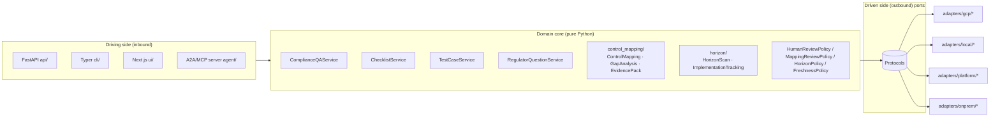
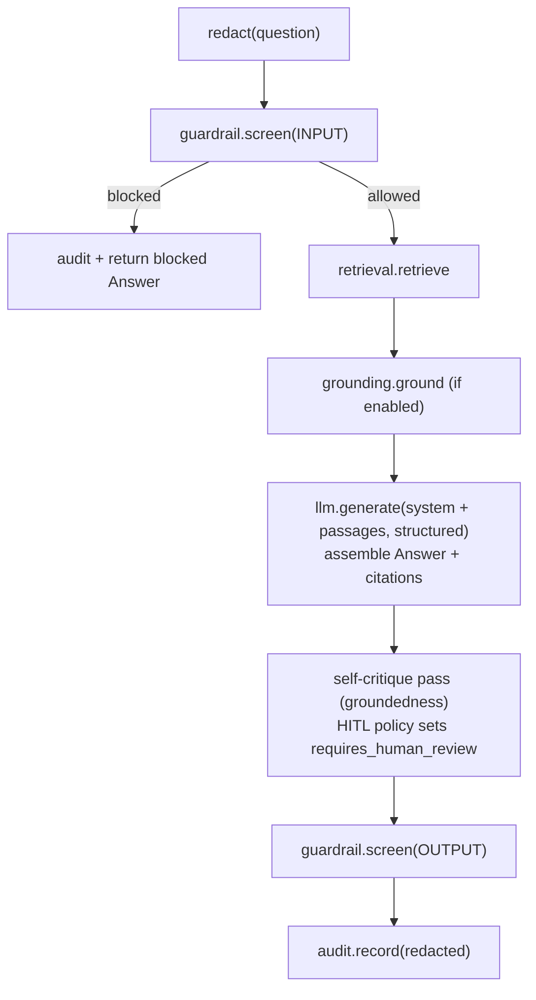
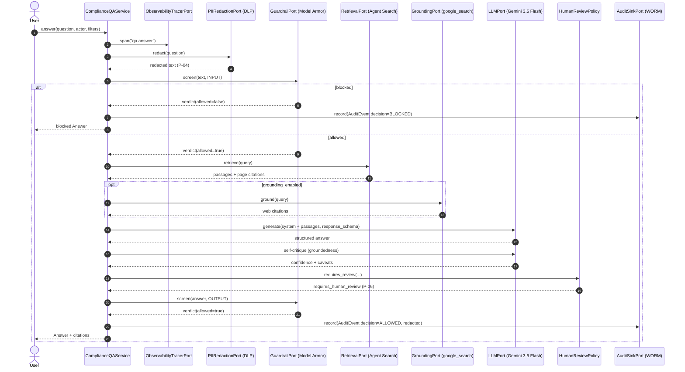
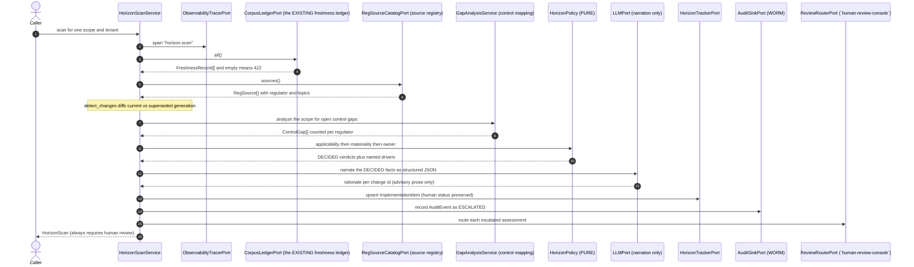
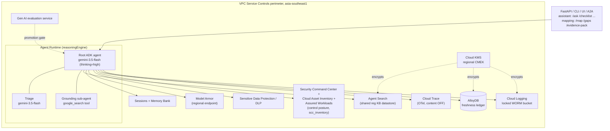
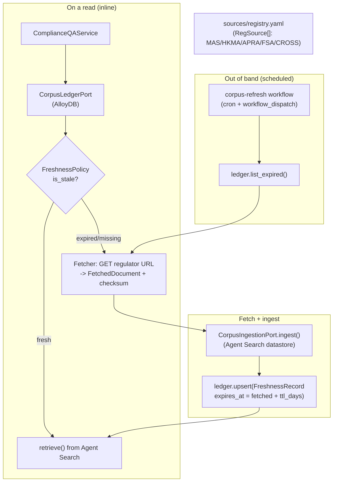

# Architecture: `compliance-advisory`

> **Authority:** SPEC > ARCHITECTURE > COMPLIANCE > README > `docs/`. See
> [`docs/doc-authority.md`](docs/doc-authority.md).

This document goes deeper than the [README](README.md): the complete port → adapter
table, the request pipeline as a sequence diagram, the runtime topology on Agent Runtime,
the data/freshness pipeline, the relationship to the platform dependencies, and two
reusable principle catalogues (section 8 portability, section 9 security) written so other
projects can lift the patterns: each principle states the rule generically, how this repo
implements it, and the command that proves it. The one-command version of the portability
catalogue is the offline tour `PYTHONPATH=src COMPLIANCE_PROFILE=local python
scripts/portability_demo.py` (exit 0 only if every claim holds).

The contract layer is authoritative, see [`SPEC.md`](SPEC.md). This file describes how the
pieces fit together; it does not redefine them.

---

## 1. Hexagonal overview

`compliance-advisory` is a **ports-and-adapters** (hexagonal) application. The domain core in
[`src/compliance_advisory/domain/`](src/compliance_advisory/domain/) owns all
orchestration and has **no** dependency on Google Cloud, ADK, FastAPI, or any framework , 
only the Python standard library. Everything the domain needs from the outside world is
expressed as a `typing.Protocol` **port**; concrete **adapters** are bound to ports by
dotted path in [`config/settings.yaml`](config/settings.yaml) and instantiated lazily by
the `Container` in [`config.py`](src/compliance_advisory/config.py).



The `Container` picks the adapter for the active `profile`
(`gcp` | `local` | `platform` | `onprem`), falling back to the `gcp` entry. Because every
adapter constructor is `def __init__(self, settings: Settings) -> None` and **all** Google
Cloud SDK imports are **lazy** (inside methods / `__init__`), the `local` and `onprem`
profiles import and run with **no GCP SDK installed**. The `local` profile is a WORKING
offline stack (SQLite FTS5 retrieval, deterministic LLM, heuristic guardrail, regex DLP,
append-only local audit); `onprem` is the fail-fast migration target.

### 1.1 Stable kernel versus `compliance-advisory` vertical

The domain has an explicit fork boundary even though backward compatibility keeps the public
dataclasses in `domain/models.py`:

- The **stable kernel sections** are retrieval/citation envelopes, LLM messages and responses,
  guardrail/redaction verdicts, session/memory, audit, evaluation, registry/tool and freshness
  envelopes. Forks preserve their field and serialization contracts because ports and audit
  evidence depend on them.
- The **`compliance-advisory` vertical sections** are the regulatory taxonomy and the generated `Answer`,
  `ChecklistItem`, `ControlChecklist`, `TestCase` and `RegulatorQuestion` artifacts, plus the
  `control_mapping/` and `horizon/` modules. A vertical fork may replace these while continuing
  to use the kernel envelopes.

The dependency direction is vertical services -> stable envelopes -> ports. Stable envelopes
never import a service, adapter, API schema, or vertical orchestrator. The section markers in
`domain/models.py` and the contract test preserve this boundary without breaking existing imports.

---

## 2. The ports → adapter table

Every port is an `@runtime_checkable` `Protocol` under
[`src/compliance_advisory/ports/`](src/compliance_advisory/ports/). The `gcp` column is
the primary managed-service adapter; the `local` column is a WORKING, SDK-free offline
adapter (deterministic + seedable); the `platform` column (where present) is a thin HTTP
client to a horizontal-platform service; the `onprem` column is a placeholder stub that
**constructs cleanly and satisfies the Protocol** but raises `NotImplementedError` from
every method (the migration target is Google Distributed Cloud, no third-party product is
named).

| # | Port (`Protocol`) | Concern | `gcp` adapter | `local` adapter (SDK-free) | `onprem` placeholder |
|---|-------------------|---------|---------------|----------------------------|----------------------|
| 1 | `RetrievalPort` | Passage retrieval | `gcp.agent_search_retrieval:AgentSearchRetrievalAdapter` | `local.retrieval:LocalFtsRetrievalAdapter` (SQLite FTS5) | `onprem.retrieval:OnPremRetrievalAdapter` |
| 2 | `LLMPort` | Reasoning / triage | `gcp.gemini_llm:GeminiLLMAdapter` | `local.llm:LocalDeterministicLLMAdapter` | `onprem.llm:OnPremLLMAdapter` |
| 3 | `GroundingPort` | Public-web grounding | `gcp.gemini_grounding:GeminiGoogleSearchGroundingAdapter` | `local.grounding:LocalDisabledGroundingAdapter` | `onprem.grounding:OnPremGroundingAdapter` |
| 4 | `GuardrailPort` | Input/output screening (`agent-guardrail-gateway`) | `gcp.model_armor_guardrail:ModelArmorGuardrailAdapter` | `local.guardrail:LocalHeuristicGuardrailAdapter` | `onprem.guardrail:OnPremGuardrailAdapter` |
| 5 | `PIIRedactionPort` | PII de-identification (`agent-guardrail-gateway`, P-04) | `gcp.dlp_redaction:DlpRedactionAdapter` | `local.redaction:LocalRegexRedactionAdapter` | `onprem.redaction:OnPremRedactionAdapter` |
| 6 | `AgentRuntimePort` | Hosted agent | `gcp.agent_runtime:AgentRuntimeAdapter` | `local.runtime:LocalAgentRuntimeAdapter` | `onprem.runtime:OnPremAgentRuntimeAdapter` |
| 7 | `SessionPort` | Per-case session state | `gcp.vertex_sessions:VertexSessionsAdapter` | `local.session:LocalSessionAdapter` | `onprem.session:OnPremSessionAdapter` |
| 8 | `MemoryPort` | Durable analyst memory | `gcp.vertex_memory_bank:VertexMemoryBankAdapter` | `local.memory:LocalMemoryAdapter` | `onprem.memory:OnPremMemoryAdapter` |
| 9 | `AuditSinkPort` | WORM audit (`agent-observability`, P-07) | `gcp.cloud_logging_audit:CloudLoggingAuditAdapter` | `local.audit:LocalAppendOnlyAuditAdapter` | `onprem.audit:OnPremAuditAdapter` |
| 10 | `ObservabilityTracerPort` | Tracing + FinOps (`agent-observability`) | `gcp.cloud_trace_tracer:CloudTraceTracerAdapter` | `local.tracer:LocalNoopTracerAdapter` | `onprem.tracer:OnPremTracerAdapter` |
| 11 | `EvaluationGatePort` | Eval gate (`model-quality-gate`, P-08) | `gcp.genai_eval:GenAiEvalAdapter` | `local.evaluation:LocalOfflineEvalAdapter` | `onprem.evaluation:OnPremEvalAdapter` |
| 12 | `AgentRegistryPort` | A2A registry (`agent-registry`) | `gcp.a2a_registry:A2ARegistryAdapter` | `local.registry:LocalRegistryAdapter` | `onprem.registry:OnPremRegistryAdapter` |
| 13 | `ToolCatalogPort` | Governed MCP tools (`agent-registry`) | `gcp.mcp_tool_catalog:McpToolCatalogAdapter` | `local.tool_catalog:LocalToolCatalogAdapter` | `onprem.tool_catalog:OnPremToolCatalogAdapter` |
| 14 | `CorpusLedgerPort` | Freshness ledger | `gcp.alloydb_ledger:AlloyDBLedgerAdapter` | `local.ledger:LocalLedgerAdapter` (SQLite) | `onprem.ledger:OnPremLedgerAdapter` |
| 15 | `CorpusIngestionPort` | Document ingestion | `gcp.agent_search_ingestion:AgentSearchIngestionAdapter` | `local.retrieval:LocalIngestionAdapter` | `onprem.ingestion:OnPremIngestionAdapter` |
| 16 | `RequirementSourcePort` | Requirement text for control mapping | `adapters.requirements:RetrievalRequirementSourceAdapter` (in-process bind to `RetrievalPort`) | same adapter, follows the active profile's `RetrievalPort` | same adapter, inherits the on-prem retrieval placeholder's fail-fast |
| 17 | `ControlInventoryPort` | Observed GCP control posture | `gcp.scc_inventory:SccControlInventoryAdapter` (SCC + Asset Inventory + Assured Workloads) | `local.inventory:LocalControlInventoryAdapter` (canned posture) | `onprem.inventory:OnPremControlInventoryAdapter` |
| 18 | `RegSourceCatalogPort` | Regulator-grade metadata per corpus source (horizon) | `adapters.source_catalog:RegistrySourceCatalogAdapter` (the in-repo source registry) | same adapter | same adapter |
| 19 | `HorizonTrackerPort` | Implementation journey per assessed change (horizon) | `gcp.alloydb_horizon_tracker:AlloyDBHorizonTrackerAdapter` | `local.horizon_tracker:LocalHorizonTrackerAdapter` (SQLite) | `onprem.horizon_tracker:OnPremHorizonTrackerAdapter` |

Rows 16 and 17 back the control-mapping module (the control-mapping capability). Ports 1..15
are the assistant's driven ports; two further cross-cutting ports (`IdentityPort`,
`ReviewRouterPort`) are covered in `COMPLIANCE.md` (the R8 review-routing rule and the
server-side identity controls) and the §9 security catalogue. `RequirementSourcePort` is
special: it does **not** carry its own backend. It binds **in-process** to whichever
`RetrievalPort` adapter the active profile selects (the `compliance-reg-kb` Agent Search
store on `gcp`, the SQLite FTS5 corpus on `local`), so there is exactly one reg KB. This
single adapter replaced three retired the cloud control-mapping toolkit paths: the standalone Gemini File Search store
`control-mapping-reg-kb`, the HTTP hop from the toolkit to the assistant's `/ask`, and the
duplicate local reg seed. `ControlInventoryPort` has **no** `platform` variant, posture is
read where the service runs.

Rows 18 and 19 back the horizon-scanning module. `RegSourceCatalogPort` binds to the SAME
class under every profile because the source registry is a repo-local YAML file rather than
a managed service: pinning one implementation is what makes the horizon diff byte-identical
offline and in production, and there is nothing cloud-specific for a placeholder to stand in
front of. `HorizonTrackerPort` does have a real managed backend (an AlloyDB table beside the
freshness ledger), so its on-prem placeholder raises rather than returning empty results, a
silent "nothing to implement" would let a regulatory obligation disappear from the journey.
Horizon scanning adds **no** new corpus port: it reads the existing `CorpusLedgerPort`
(row 14), which was extended with the generation each ingest supersedes.

The `guardrail`, `audit` and `registry` ports additionally have a `platform` HTTP-client
adapter (`platform.remote_guardrail` / `remote_audit` / `remote_registry`) for deployment
inside the full horizontal platform. Under `local`, the platform-client ports use in-process
local implementations rather than HTTP to sibling services (a laptop runs one app).
Optional emulator opt-in: when `FIRESTORE_EMULATOR_HOST` is set and the `[gcp]` extra is
installed, the registry / sessions / memory / ledger local adapters route to the Firestore
emulator (google client imported lazily, only on that branch).

> Dotted paths above are relative to the `compliance_advisory.adapters` package; the
> fully-qualified bindings are in [`config/settings.yaml`](config/settings.yaml) under
> `adapters:` and are the build contract: **module paths and class names there are
> fixed**. Every port above has a `gcp`, `local` and `onprem` binding.

---

## 3. The request pipeline

The domain services own orchestration and call only ports. The standard **answer** pipeline
(from [`SPEC.md`](SPEC.md) §5) is:



> All steps wrapped in `tracer.span`.

As a sequence:



Key invariants:
- **Redact before model and before audit**, PII never reaches the model, a trace span, or
  the WORM sink (P-04). The `AuditEvent` stores `redacted_prompt` / `redacted_response`.
- **Both directions screened**, INPUT before retrieval, OUTPUT before return (`agent-guardrail-gateway`).
- **Everything inside a span**, but message content capture is OFF, so spans carry
  structure and token usage, never prompt/response text.
- The Checklist / TestCase / RegulatorQuestion services follow the same shape; they default
  to `requires_human_review = True` because their outputs are consequential (P-06).

---

## 3a. The control-mapping pipeline

The control-mapping module (`domain/control_mapping/`) runs a **different** pipeline from
the assistant path. It reasons over the bank's own GCP control posture, not customer
free-text, so it has **no redaction and no guardrail step**, by design (see
`COMPLIANCE.md` for the per-module posture split). Its requirement source is bound
in-process to the assistant's `RetrievalPort`, so both families draw on the one reg KB.

```mermaid
sequenceDiagram
    autonumber
    actor Caller
    participant Svc as ControlMappingService
    participant Tr as ObservabilityTracerPort
    participant Req as RequirementSourcePort
    participant Ret as RetrievalPort (shared reg KB, in-process)
    participant Inv as ControlInventoryPort (scc_inventory)
    participant LLM as LLMPort (Gemini 3.5 Flash)
    participant Pol as MappingReviewPolicy
    participant Aud as AuditSinkPort (WORM)

    Caller->>Svc: map(scope, actor, regulator?)
    Svc->>Tr: span("mapping.map")
    Svc->>Req: fetch(scope, regulator)
    Req->>Ret: retrieve(query)
    Ret-->>Req: passages + page citations
    Req-->>Svc: RegRequirement[] (empty -> RequirementsEmptyError / 422)
    Svc->>Inv: observe(scope) + list_controls()
    Inv-->>Svc: ControlObservation[] + GcpControl[] (none -> PostureUnavailableError / 422)
    Svc->>LLM: generate(map requirements -> controls, structured JSON)
    LLM-->>Svc: {requirement_id, control_ids, coverage, rationale}[]
    Note over Svc: resolve ids to GcpControl; compute Coverage from ENABLED obs (server-side);<br/>PARTIAL/NONE or HIGH/CRITICAL gap sets requires_human_review
    Svc->>Aud: record(AuditEvent)
    Svc-->>Caller: ControlMapping[]
```

- **`GapAnalysisService.analyze`** runs the same pipeline and returns only the PARTIAL/NONE
  mappings as `ControlGap[]` (severity + remediation).
- **`EvidencePackService.build`** runs the pipeline, derives gaps, computes the coverage
  summary, and stamps `requires_human_review=True` **unconditionally**: an evidence pack is
  the artifact handed to a regulator, so a human checker always signs it off (P-06). It is
  routed to `human-review-console` for review (R8).
- **Coverage is computed server-side** in `domain/control_mapping/_mapping.py` from which
  mapped controls are observed ENABLED; the model's coverage hint is only a fallback when no
  observation exists.

---

## 3b. The horizon-scanning pipeline

The horizon module (`domain/horizon/`) runs a **third** pipeline. Like the mapping module it
has no redaction and no guardrail step by design (see `COMPLIANCE.md`): it reasons over
published regulatory instruments and the bank's own implementation state. Its distinguishing
property is the ORDER of the steps. Every consequential judgement is computed in pure code
and audited BEFORE the model is called, so the model can only add prose to a decision that
is already fixed.



- **Detection reuses the existing ledger.** `FreshnessRecord` gained
  `previous_version` / `previous_checksum` / `previous_fetched_at` / `previous_status`, and
  `domain/horizon/carry_forward` rolls the superseded generation forward on every ingest
  upsert. A byte-identical re-fetch does not advance the diff base, so an unscanned change
  stays visible. There is no shadow store of corpus state.
- **The numbers are pure and bank-owned.** `HorizonPolicy` computes an additive 0..100
  materiality score from named `MaterialityDriver` contributions whose sum IS the score, and
  bands it against `config/settings.yaml` `horizon.band_thresholds`. The drivers travel on
  the wire, so a reviewer can reconstruct the arithmetic without rerunning the scan.
- **Ownership routing is deterministic** (topic rule, then regulator rule, then the
  configured default) and is itself treated as a consequential call: any routed change sets
  `requires_human_review` and is routed to `human-review-console` (R8).
- **The journey closes the loop into control mapping.** Open control gaps for the same
  regulator raise the materiality score, and a closure records the `control_ids` from the
  mapping module that evidence it.
- **Tracking is tenant-partitioned and fail-closed.** The port lookup is tenant-agnostic and
  the tenant check lives in `ImplementationTrackingService`, so a cross-tenant access is a
  403 denial rather than a 404 that hides whether the change exists.

---

## 4. Runtime topology on Agent Runtime

In the `gcp` profile, the ADK agent is hosted on **Agent Runtime** (ex-Agent Engine, a
`reasoningEngine` resource) inside a VPC-SC perimeter in `asia-southeast1`. The grounding
`google_search` tool lives in its **own sub-agent** because only one built-in tool is
allowed per agent.



- **One region for everything** (`asia-southeast1`); regional endpoints + per-service CMEK
  give the residency guarantee that a global endpoint would not.
- **Sessions / Memory Bank** provide per-case conversation state and durable analyst memory
  via the GA `VertexAiSessionService` / `VertexAiMemoryBankService`.
- **Eval gate** is a promotion-time check, not an inline request dependency.

---

## 5. Data / freshness pipeline

The regulatory corpus is materialised at runtime with a **7-day TTL** (`corpus.ttl_days`).
The repo ships only the **source registry**
(`src/compliance_advisory/pipelines/sources/registry.yaml`) plus a tiny synthetic sample , 
never a vendored copy of the regulations.



- **Ledger record** (`FreshnessRecord`): `source_id`, `url`, `version`, `fetched_at`,
  `expires_at`, `checksum`, `status` (`FRESH` / `EXPIRED` / `MISSING` / `FAILED`), plus the
  generation it supersedes (`previous_version`, `previous_checksum`, `previous_fetched_at`,
  `previous_status`). Those four fields are what make the ledger DIFFABLE, and therefore what
  lets horizon scanning (§3b) run on the one ledger instead of a parallel copy. They are
  written by `domain/horizon/carry_forward` inside the same upsert the ingest already does,
  and both the SQLite and AlloyDB adapters migrate an existing table in place.
- **Inline path:** a query checks the ledger; if a needed source is stale or missing it is
  re-fetched and re-ingested **before** the answer is generated, so answers are never built
  on an expired document.
- **Scheduled path:** `CorpusLedgerPort.list_expired()` drives a background refresh so most
  reads hit fresh data and never pay the fetch latency. It has no scheduler today: the workflow
  that described the schedule could not run and was removed, so this path is manual until a
  Cloud Scheduler job is wired for it.
- **Policy in the domain:** `FreshnessPolicy(ttl_days).expires_at(...)` / `.is_stale(...)`.

---

## 6. Dependency relationship to the horizontal platform

`compliance-advisory` (catalog `compliance-advisory`, group `rsk`) is a leaf application that depends on three platform
services. The dependency rules **R1..R6** (see [`COMPLIANCE.md`](COMPLIANCE.md)) require that
those concerns are *not* re-implemented in `compliance-advisory` but consumed from the platform when present.
`compliance-advisory` satisfies this two ways without changing the domain:

```mermaid
flowchart LR
    subgraph c1["`compliance-advisory` (this repo)"]
        DOMAIN[Domain core]
        GUARD[GuardrailPort / PIIRedactionPort]
        AUDIT[AuditSinkPort]
        REGP[AgentRegistryPort]
        DOMAIN --> GUARD & AUDIT & REGP
    end

    subgraph standalone["profile = gcp (standalone)"]
        MA[Model Armor + DLP]
        CL[Cloud Logging WORM]
        A2A[Local A2A AgentCard]
    end

    subgraph platform["profile = platform (inside the horizontal platform)"]
        `agent-guardrail-gateway`[agent-guardrail-gateway]
        `agent-observability`[agent-observability]
        `agent-registry`[agent-registry]
    end

    GUARD -- gcp --> MA
    AUDIT -- gcp --> CL
    REGP  -- gcp --> A2A
    GUARD -- platform --> `agent-guardrail-gateway`
    AUDIT -- platform --> `agent-observability`
    REGP  -- platform --> `agent-registry`
```

| Dependency | Repo | Backs `compliance-advisory` ports | HTTP contract (SPEC §6) |
|------------|------|----------------|-------------------------|
| `agent-guardrail-gateway` (Model Armor + DLP) | `agent-guardrail-gateway` | `GuardrailPort`, `PIIRedactionPort` | `POST /v1/guardrail/screen`, `POST /v1/redact` |
| `agent-registry` (A2A + MCP catalog) | `agent-registry` | `AgentRegistryPort` | `POST/GET /v1/agents`, `/.well-known/agent-card.json` |
| `agent-observability` (WORM + Trace + FinOps) | `agent-observability` | `AuditSinkPort` | `POST /v1/audit`, `GET /v1/audit` |
| `model-quality-gate` | (Gen AI evaluation service) | `EvaluationGatePort` | promotion gate, not an HTTP dep |

The `platform` adapters (`adapters/platform/remote_*.py`) are thin HTTP clients whose JSON
field names mirror the domain dataclasses exactly (enums as strings), so swapping from the
direct-GCP adapter to the remote client is, again, a binding change, never a domain change.

---

## 7. Why this shape

- **No vendor lock-in (P-02):** the domain depends on Protocols, not SDKs. The on-prem
  placeholder adapters prove interface parity and make the exit path concrete (P-12, see
  [`docs/onprem-migration.md`](docs/onprem-migration.md)).
- **Testable without the cloud:** lazy SDK imports + in-memory fakes mean the whole suite
  runs under the `onprem` profile with no Google Cloud packages installed.
- **Residency by construction:** one region, regional endpoints, per-service CMEK, VPC-SC.
- **Auditable by construction:** redact-before-everything, WORM audit, page-level citations,
  maker-checker, and a promotion eval gate.

---

## 8. Portability principles (a reusable catalogue)

Portability here means lock-in converted from an open-ended exposure into a priced,
controlled risk. It has to hold at three layers: **compute** (where the decision logic
runs), **data** (records, evidence, audit trails), and **experience/identity** (where
users reach the system and how they sign in). Each principle below is stated generically
(steal it), then grounded in this repo (mechanism plus proof). The one-command version of
this whole section is the offline portability tour:

```bash
PYTHONPATH=src COMPLIANCE_PROFILE=local python scripts/portability_demo.py   # exit 0 only if every claim holds
```

The reference catalogue this mirrors runs PT-1..PT-14; the IDs are kept identical so the
two catalogues cross-reference cleanly. **Not applicable to this repo:** PT-10 (the local
audit sink uses a SHA-256 chain over canonical JSON and supports verified JSONL export/reload
round-trip, so the "audit trail survives and proves the move" claim is absent here; the
WORM-at-rest and framework-free-records halves are covered by SC-11 and PT-8). All other
PT ids apply, some in an adapted form noted inline.

### 8.1 Compute layer

| # | Principle (generic) | Mechanism in this repo | Proof |
|---|---------------------|------------------------|-------|
| PT-1 | **Pure decision core.** The domain imports nothing from any vendor: no cloud SDK, no web framework, not even the config parser. Everything external is a narrow interface. | [`domain/`](src/compliance_advisory/domain/) is stdlib-only; the interfaces live in [`ports/`](src/compliance_advisory/ports/) as `@runtime_checkable typing.Protocol`s. | `grep -rlE "google\|fastapi\|httpx\|pydantic\|yaml" src/compliance_advisory/domain/` returns nothing (exit 1). |
| PT-2 | **One construction convention, config-driven binding.** Every adapter is built the same way from one settings object, and the port-to-adapter wiring is data (a config file), not code. Swapping vendors is an edit to config, reviewable in a diff. | `Adapter(settings: Settings)` for every adapter; dotted-path bindings under `adapters:` in [`config/settings.yaml`](config/settings.yaml); the `Container` in [`config.py`](src/compliance_advisory/config.py) resolves them lazily, one `cached_property` per port. | `pytest tests/contract/test_port_parity.py::test_adapter_constructs_with_single_settings_arg -q` |
| PT-3 | **A profile swaps the whole stack.** One environment variable selects a coherent adapter family for every port at once, with no domain edits. | `COMPLIANCE_PROFILE` = `gcp` \| `local` \| `platform` \| `onprem`; `Container._bind` picks the entry for the active profile. Note (adapted from the reference): here the fallback is uniform, a port with no binding for the active profile falls back to the `gcp` entry (there is no separate "offline profile never falls back" guard), so `local`/`onprem` completeness is instead enforced by the parity test requiring every port to declare both bindings. | Act 1 of the tour; `pytest tests/contract/test_port_parity.py::test_every_port_has_onprem_and_local_bindings -q`. |
| PT-4 | **Vendor imports are lazy.** SDK imports live inside methods or `TYPE_CHECKING`, never at module top level, so every module imports on a machine with no vendor packages installed. | All `adapters/gcp/*` and `agent/*` Google imports are in-method or under `TYPE_CHECKING` (see [`adapters/gcp/gemini_llm.py`](src/compliance_advisory/adapters/gcp/gemini_llm.py)); the GCP SDKs live in the optional `[gcp]` extra. | `grep -rnE "^(import\|from) (google\|vertexai)" src/compliance_advisory/adapters/gcp/` returns nothing; the whole gate runs in a `[dev]`-only venv. |
| PT-5 | **The offline profile WORKS: it is not a mock.** Ship a real, deterministic, in-process implementation of every port (embedded index, schema-driven LLM stand-in, heuristic guardrail, regex redaction, append-only audit). Make it the default for dev, tests and CI so it can never rot. | The `local` family: SQLite FTS5 retrieval ([`adapters/local/retrieval.py`](src/compliance_advisory/adapters/local/retrieval.py)), deterministic schema-driven LLM, heuristic guardrail, regex DLP, append-only SQLite audit. `local` is the adapter family bound whenever `COMPLIANCE_PROFILE` is unset, but an unset variable is not a chosen `local`: no security decision reads the absence as consent. | `pytest tests/contract/test_port_parity.py::test_local_retrieval_returns_real_passages -q`; Act 1 answers a cited question offline. |
| PT-6 | **The exit target exists on day one, as a fail-fast placeholder.** Stubs that construct cleanly, satisfy every interface and raise on use keep the migration honest: interface drift breaks CI, and nothing can silently return a wrong answer. | `adapters/onprem/*` raise `NotImplementedError`; the CLI maps it to exit 2 with the migration note ([`cli/main.py`](src/compliance_advisory/cli/main.py)); [`docs/onprem-migration.md`](docs/onprem-migration.md) is the checklist. | `pytest tests/contract/test_port_parity.py::test_onprem_retrieval_fails_fast -q` |
| PT-7 | **Parity is tested behaviorally, not just structurally.** "Implements the interface" is weak; put the *same request* through every implementation and require identical behavior at the boundary (same domain objects, same verdicts, byte-identical serialized payloads, fail-fast where documented). | [`tests/contract/test_behavioral_parity.py`](tests/contract/test_behavioral_parity.py): local in-process vs platform HTTP client (sibling mocked at the SPEC section 6 contract) vs onprem placeholder, for guardrail, audit and registry; retrieval determinism across two indexes; end-to-end pipeline swap. | `pytest tests/contract/test_behavioral_parity.py -q` |

### 8.2 Data layer (where switching cost compounds)

| # | Principle (generic) | Mechanism in this repo | Proof |
|---|---------------------|------------------------|-------|
| PT-8 | **Logical records are separated from physical stores.** The domain owns plain, framework-free record types; serialization to/from an open format is a documented, deliberate function, not an ORM side effect. | Frozen stdlib dataclasses in [`domain/models.py`](src/compliance_advisory/domain/models.py); `to_jsonable` in [`domain/serialization.py`](src/compliance_advisory/domain/serialization.py) (enums to `.value`, datetimes to ISO 8601, dataclasses to ordered field dicts). | `pytest "tests/unit/test_serialization_and_config.py::test_to_jsonable_audit_event_is_worm_serialisable" -q` |
| PT-9 | **Search indexes are derived assets:** expensive to compute, cheap to recompute. Never let the index be the only home of the evidence; re-ingesting sources into a new backend must rebuild it. | The corpus is materialised at runtime with a 7-day TTL from the source registry ([`pipelines/sources/registry.yaml`](src/compliance_advisory/pipelines/sources/registry.yaml)); [`adapters/local/retrieval.py`](src/compliance_advisory/adapters/local/retrieval.py) `LocalIngestionAdapter.ingest` re-indexes a source from its bytes (delete-then-add) into the FTS5 store, and the retrieval index self-seeds on first use. | `pytest "tests/unit/test_checklist_testcases_regq.py" -q` exercises the seeded/rebuilt index; the retrieval-determinism parity test rebuilds two independent indexes and gets identical passages. |
| PT-10 | Local hash-chain verification plus JSONL export/restore works without a cloud SDK; the managed sink adds a locked Cloud Logging bucket. | `LocalAppendOnlyAuditAdapter.verify_chain`, `export_jsonl`, `restore_jsonl`; managed WORM configuration | `pytest tests/unit/test_audit_chain.py -q` |

### 8.3 Experience / identity layer

| # | Principle (generic) | Mechanism in this repo | Proof |
|---|---------------------|------------------------|-------|
| PT-11 | **Identity is verified on the system's own side**, from a signed credential, never trusted from the host application, and the verification regime is itself an adapter: dev personas offline, platform-injected assertion in managed mode. | `IdentityPort` with bindings: seeded personas (`local`, [`adapters/local/identity.py`](src/compliance_advisory/adapters/local/identity.py)), IAP assertion verification (`gcp`/`platform`, [`adapters/gcp/iap_identity.py`](src/compliance_advisory/adapters/gcp/iap_identity.py)), client-IdP placeholder (`onprem`). Adapted from the reference: this repo has no self-issued OIDC-session profile. | Act 4 of the tour; `pytest tests/unit/test_identity.py tests/unit/test_api_identity.py -q`. |
| PT-12 | **Every UI integration tier stays open**: native API integration, sandboxed embed, and a standalone link, so the capability is not welded to one host application. | REST plus the A2A AgentCard ([`agent/agent_card.py`](src/compliance_advisory/agent/agent_card.py)), the embeddable Next.js console ([`ui/`](ui/)), and the standalone `compliance serve` deployment; CSP `frame-ancestors` and per-tenant CORS are configurable. | [`docs/embedding-and-identity.md`](docs/embedding-and-identity.md); `pytest "tests/unit/test_api_identity.py::test_embedding_security_headers_present" -q`. |

### 8.4 Infrastructure as a replaceable input

| # | Principle (generic) | Mechanism in this repo | Proof |
|---|---------------------|------------------------|-------|
| PT-13 | **Infra names and postures are variables, not literals.** The genuinely per-deploy and irreversible pieces are explicit knobs, not a fork: the target region (validated), the WORM retention window, and toggles for the org-level and irreversible pieces. | [`infra/terraform/variables.tf`](infra/terraform/variables.tf): `project_id`, `region` (a deploy-time input validated against `allowed_regions`, the residency allowlist, which also generates the resource-location Org Policy; both default to `asia-southeast1`), `retention_days` (validated), `enable_vpc_sc`, `org_id`, `access_policy_id`. Adapted from the reference: this stack is single-tenant with concrete in-region service names (no `name_prefix`), so the "second enterprise is a tfvars file" claim is narrower here. | `terraform -chdir=infra/terraform validate` (Success); `terraform -chdir=infra/terraform fmt -check -recursive`. |
| PT-14 | **Outputs are the contract between infra and app.** Every Terraform output names the exact setting the app reads, and the app's config resolves those variables with safe defaults, so "deploy" is apply-then-export, never editing code. | [`infra/terraform/outputs.tf`](infra/terraform/outputs.tf) descriptions carry the `settings.yaml` / `COMPLIANCE_*` names (`kms_key`, `data_store_id`, `alloydb_instance_uri`, ...); [`config/settings.yaml`](config/settings.yaml) reads `${COMPLIANCE_...:-default}` tokens, coerced in [`config.py`](src/compliance_advisory/config.py). | `terraform -chdir=infra/terraform validate`; [`docs/runbook.md`](docs/runbook.md) section 0/1 is the copy-paste export block. |

---

## 9. Security principles (a reusable catalogue)

Same format: the rule, the mechanism here, the proof. The theme is *by construction, not
by convention*: every control included below is enforced in code or infra and has a test
or a fail-fast error, so a regression is a red build rather than a policy violation
discovered later.

The reference catalogue this mirrors runs SC-1..SC-17; the IDs are kept identical.
**Not applicable to this repo:**
- **SC-4** (tenant/case scoping at the retrieval layer): the retrieval port and its adapters
  carry no ACL tags or `acl_principals`; the regulatory corpus is a shared knowledge base,
  not per-case evidence, so there is no cross-case query-shape isolation to prove here.
- **SC-5** (deterministic hard signals the model cannot soften): this assistant has no
  sanctions/PEP/risk-band engine, so there are no post-LLM consequential floors to enforce.
- **SC-9** (pin token algorithms / fetch keys, never trust headers): there is no OIDC/JWKS
  verification module; the IAP adapter delegates signature/audience/expiry verification to
  the Google SDK, which has no SDK-free unit-test proof, so it is not claimed here.
- **SC-12** (record AND detect): there are no log-based security metrics or alert policies
  in the Terraform (no `monitoring.tf`).

All other SC ids apply, some in an adapted form noted inline.

### 9.1 Data protection in the request path

| # | Principle (generic) | Mechanism in this repo | Proof |
|---|---------------------|------------------------|-------|
| SC-1 | **Redact before everything.** PII is removed at the boundary, before any model call, index write, trace span or audit record, so no downstream system ever holds raw identifiers. | `redaction.redact` is step 1 of `ComplianceQAService._answer_inner` and the three generators ([`domain/qa_service.py`](src/compliance_advisory/domain/qa_service.py), [`checklist_service.py`](src/compliance_advisory/domain/checklist_service.py)); the `AuditEvent` stores only `redacted_prompt`/`redacted_response` (P-04). | `pytest "tests/unit/test_qa_service.py::test_redaction_runs_before_retrieval" "tests/unit/test_qa_service.py::test_normal_path_audit_record_is_redacted" "tests/unit/test_checklist_testcases_regq.py::test_generators_redact_before_retrieval" -q` |
| SC-2 | **Screen both directions.** Guardrail the INPUT before retrieval/model work and the OUTPUT before returning it; a block is audited, and for consequential generators it is raised, never swallowed. | `guardrail.screen(INPUT)` then `screen(OUTPUT)` in the Q&A pipeline; a blocked input audits `BLOCKED` and returns a caveated, review-flagged `Answer`, while the consequential generators raise `GuardrailBlockedError` ([`domain/errors.py`](src/compliance_advisory/domain/errors.py)). | `pytest "tests/unit/test_qa_service.py::test_blocked_input_returns_blocked_answer_and_audits" "tests/unit/test_checklist_testcases_regq.py::test_checklist_blocked_input_raises" -q`; the guardrail behavioral-parity test. |
| SC-3 | **Never answer ungrounded.** Empty retrieval is a hard error, not a degraded answer; every generated claim carries source-and-page provenance a reviewer can check. | All four generators raise `RetrievalEmptyError` on empty search. Q&A writes the ESCALATED audit record before raising, and the API returns an explicit 422 refusal. Every artifact maps `used_source_ids` back to page-level `Citation`s ([`domain/_grounded.py`](src/compliance_advisory/domain/_grounded.py)). | `pytest "tests/unit/test_checklist_testcases_regq.py::test_checklist_empty_corpus_raises" "tests/unit/test_qa_service.py::test_normal_path_maps_citations_with_pages" "tests/unit/test_qa_service.py::test_empty_retrieval_raises_after_escalation_audit" -q`; `python eval/run_eval.py`. |

### 9.2 Decision integrity

| # | Principle (generic) | Mechanism in this repo | Proof |
|---|---------------------|------------------------|-------|
| SC-6 | **Maker-checker on every consequential output.** Answers, checklists, test cases and regulator-question sets always require human review. Confidence and severity can only raise the review level, never remove the checker (P-06). | `HumanReviewPolicy.from_policy` in [`domain/hitl.py`](src/compliance_advisory/domain/hitl.py) consumes the bank-owned `policy:` bundle. `Answer.requires_human_review` defaults true and the generators audit `ESCALATED`. | `pytest "tests/unit/test_hitl_and_freshness.py::test_confident_low_severity_answer_still_requires_review" "tests/unit/test_checklist_testcases_regq.py::test_checklist_audits_as_escalated" -q` |
| SC-7 | **Quality is a promotion gate, not a dashboard.** Groundedness, citation accuracy, faithfulness and PII safety are scored against thresholds and a failing score blocks the build/promotion. | [`eval/run_eval.py`](eval/run_eval.py) (safety >= 0.99, groundedness >= 0.80, citation_accuracy >= 0.90, faithfulness >= 0.80; thresholds in [`eval/rubrics/`](eval/rubrics/)); CI enforces it via the hosted GitHub Actions check; at promotion the Gen AI evaluation service (`gcp` profile) is the authority. | `python eval/run_eval.py` exits non-zero on any miss (exit 0 today). |

### 9.3 Identity and secrets

| # | Principle (generic) | Mechanism in this repo | Proof |
|---|---------------------|------------------------|-------|
| SC-8 | **Resolve identity server-side; ignore client-asserted actors.** The request body's actor/ACL claims are discarded; the audit actor and entitlement principals come only from a resolved credential, and failure to resolve a verified principal is a 401 (fail closed). | [`api/security.py`](src/compliance_advisory/api/security.py) `get_principal` builds a `RequestContext` from headers and asks the active `IdentityPort` adapter; any body `actor` is ignored; `IdentityError` maps to 401. | `pytest "tests/unit/test_api_identity.py::test_body_actor_is_ignored_and_default_persona_is_audited" "tests/unit/test_api_identity.py::test_unknown_dev_persona_is_401" "tests/unit/test_identity.py::test_onprem_identity_fails_fast" -q` |
| SC-10 | **Config holds the *names* of secrets, never values.** Settings reference the environment variable that holds each sensitive value (KMS key, AlloyDB URI, DLP templates, IAP audience); values are read at construction and never committed or logged. | [`config/settings.yaml`](config/settings.yaml) uses `${COMPLIANCE_...}` / `${GOOGLE_CLOUD_PROJECT}` tokens for `kms_key`, `alloydb.instance_uri`, `dlp.*_template`; [`adapters/gcp/iap_identity.py`](src/compliance_advisory/adapters/gcp/iap_identity.py) reads `COMPLIANCE_IAP_AUDIENCE` from the environment. Adapted from the reference: no `client_secret`/session-signing key here (no OIDC session). | `grep -nE "kms_key\|instance_uri\|_template" config/settings.yaml` shows only `${ENV_VAR}` references, no literal secrets. |

### 9.4 Auditability and detection

| # | Principle (generic) | Mechanism in this repo | Proof |
|---|---------------------|------------------------|-------|
| SC-11 | **Tamper-evident, already-redacted audit.** The local profile chains canonical records and verifies JSONL export/restore; the managed profile adds immutable retention. Every record is redacted before either sink. | Hash-chained SQLite in [`adapters/local/audit.py`](src/compliance_advisory/adapters/local/audit.py); locked, CMEK-bound Cloud Logging bucket in [`infra/terraform/logging_worm.tf`](infra/terraform/logging_worm.tf). | `pytest tests/unit/test_audit_chain.py tests/unit/test_qa_service.py -q`; `terraform -chdir=infra/terraform validate`. |
| SC-13 | **Traces carry telemetry, not content.** Spans and token metrics support debugging and FinOps; message-content capture stays OFF because customer PII must never reach the tracing backend. | `CloudTraceTracerAdapter` ([`adapters/gcp/cloud_trace_tracer.py`](src/compliance_advisory/adapters/gcp/cloud_trace_tracer.py), OTel, content off, metadata-only attributes); `record_token_usage` emits counts only; the `ObservabilityTracerPort` ([`ports/observability.py`](src/compliance_advisory/ports/observability.py)) has no content-bearing method. | `pytest "tests/unit/test_qa_service.py::test_normal_path_wrapped_in_tracer_span" -q`; the port contract carries no message content. |

### 9.5 Residency and platform hardening

| # | Principle (generic) | Mechanism in this repo | Proof |
|---|---------------------|------------------------|-------|
| SC-14 | **Residency by construction.** One region selected at deploy and validated (an unapproved region fails at plan/validate time); regional service endpoints, never global; an Org Policy makes out-of-region resource creation impossible rather than avoided. | `region` validated against the `allowed_regions` residency allowlist in [`infra/terraform/variables.tf`](infra/terraform/variables.tf); regional Model Armor host in [`config/settings.yaml`](config/settings.yaml); the `gcp.resourceLocations` project policy in [`infra/terraform/org_policy.tf`](infra/terraform/org_policy.tf). | `terraform -chdir=infra/terraform validate` (the `region` validation block rejects any off-list value at plan time). |
| SC-15 | **CMEK does not cascade: bind it everywhere, explicitly.** Each service that touches the data gets its own key binding and its own service-agent grant; assume nothing inherits encryption. | [`infra/terraform/kms.tf`](infra/terraform/kms.tf): one regional key ring/key with `prevent_destroy`, and explicit `cryptoKeyEncrypterDecrypter` bindings for AlloyDB, Discovery Engine (Agent Search), Vertex/Agent Runtime and Cloud Logging; the app/pipeline SAs get their own bindings in [`iam.tf`](infra/terraform/iam.tf). | `terraform -chdir=infra/terraform validate`; every CMEK-capable resource names the one key. |
| SC-16 | **Blast-radius controls default on, with an explicit dry run.** A VPC-SC perimeter around the AI/data APIs (on by default, documented dry-run-first deploy order), least-privilege per-workload service accounts, uniform bucket access and no external VM IPs. | [`infra/terraform/vpc_sc.tf`](infra/terraform/vpc_sc.tf) (`enable_vpc_sc` default `true`, deploy-order caveat documents the dry-run-first flip), two scoped SAs (app + pipeline) in [`iam.tf`](infra/terraform/iam.tf), `uniformBucketLevelAccess` and `vmExternalIpAccess` denials in [`org_policy.tf`](infra/terraform/org_policy.tf). Adapted from the reference: no `disableServiceAccountKeyCreation` org policy is present. | `terraform -chdir=infra/terraform validate`. |

### 9.6 Graceful degradation

| # | Principle (generic) | Mechanism in this repo | Proof |
|---|---------------------|------------------------|-------|
| SC-17 | **Graceful degradation is a design decision, listed per step.** Public-web grounding and self-critique are best-effort; redaction, guardrail denials and grounded retrieval are safety-critical. | `ComplianceQAService` skips unavailable secondary grounding, keeps a conservative confidence when critique fails, and hard-refuses empty primary retrieval after audit. Consequential generators likewise hard-fail on blocked input and empty retrieval. | `pytest "tests/unit/test_qa_service.py::test_empty_retrieval_raises_after_escalation_audit" "tests/unit/test_qa_service.py::test_grounding_skipped_when_disabled" "tests/unit/test_checklist_testcases_regq.py::test_checklist_empty_corpus_raises" -q` |
