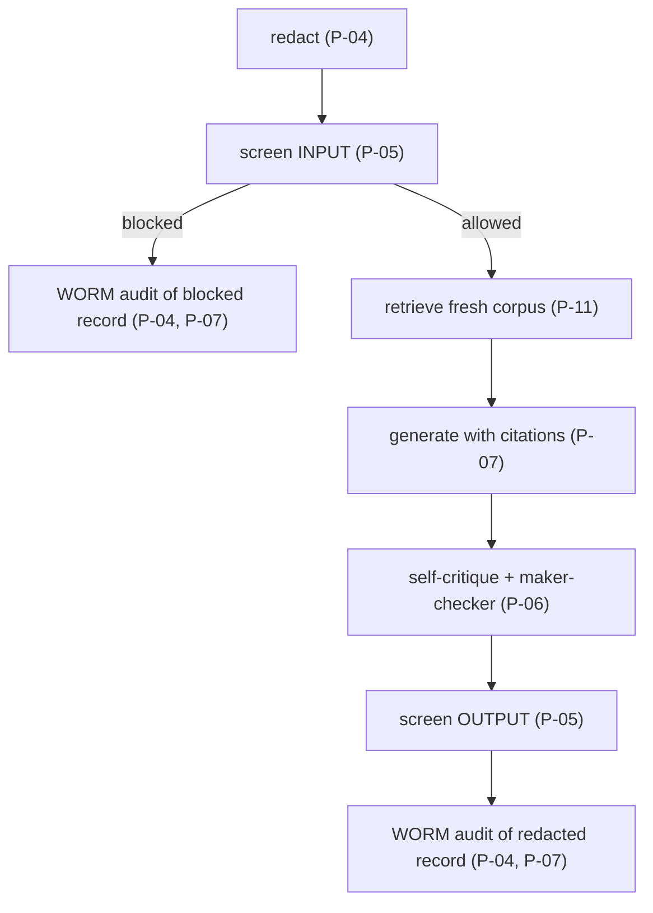

# Compliance: principle-to-control mapping

> **Authority:** SPEC > ARCHITECTURE > COMPLIANCE > README > `docs/`. See
> [`docs/doc-authority.md`](docs/doc-authority.md).

This document maps **every** GRC General Principle (**P-01..P-12**) and platform dependency
rule (**R1..R6, R8**) to the concrete control that enforces it in *this* repo, a file, an
adapter, a config value, or a Terraform resource. It is the auditor's index: each row points
to where the control actually lives, not a policy statement.

> Scope note: this is a reference build. The mappings below show *how the architecture
> enforces each principle*; a production deployment still needs your own legal, security,
> and model-risk sign-off (see [`README`](README.md) disclaimer).

Legend for "where": paths are relative to the repo root. Port modules live under
`src/compliance_advisory/ports/`; adapters under `src/compliance_advisory/adapters/`;
domain under `src/compliance_advisory/domain/`.

---

## A0. Three paths, one contract: the per-module posture split

This service runs **three paths** with **deliberately different** safety postures, because
they process different data:

- The **assistant / answer / checklist path** handles analyst free-text and may carry
  customer PII, so it keeps its full posture: Model Armor guardrail screening on INPUT and
  OUTPUT (P-05) and DLP redaction before any model call, trace span or audit write (P-04).
- The **control-mapping module** (`domain/control_mapping/`) reasons over the **bank's own
  GCP control posture**, not customer data, and takes no untrusted free-text input path. It
  therefore runs **WITHOUT Model Armor guardrails and WITHOUT DLP redaction, by design**:
  for this module, rule **R1** does not apply and **P-04 = n/a** (there is no customer PII
  to redact, and no `PIIRedactionPort` / `GuardrailPort` in its pipeline). This is an
  intentional scoping decision, documented here rather than papered over with a no-op
  guardrail. The mapping module's `AuditEvent` prompt/response fields carry only scope ids
  and coverage summaries.
- The **horizon-scanning module** (`domain/horizon/`) reasons over **published regulatory
  instruments** (their metadata and freshness state) and the bank's **own** implementation
  state. Like the mapping module it takes no untrusted free-text input path and carries no
  customer PII, so it also runs **WITHOUT Model Armor guardrails and WITHOUT DLP redaction,
  by design**: rule **R1** does not apply and **P-04 = n/a** for this path. Its
  `AuditEvent` prompt/response fields carry only a scope id and per-source
  applicability / materiality verdicts.

**Both R8 human-review paths coexist against the one `human-review-console` review contract.** There is a
single `ReviewRouterPort` and a single `human-review-console` Human-Review & Maker-Checker Console contract;
the two paths feed it under different policies:

- **Evidence packs are ALWAYS sent for human review** (`EvidencePackService` stamps
  `requires_human_review=True` unconditionally, `MappingReviewPolicy`): the pack is the
  artifact handed to a regulator, so a checker always signs it off.
- **Horizon assessments escalate on routing and on band**: `HorizonPolicy.requires_review`
  returns `True` for any change routed to an owner (an ownership assignment is itself a
  consequential call), for any change at or above the configured `review_band`, and for any
  unresolved (`conditional`) applicability. Closing a tracked change as `implemented` or
  `accepted_risk` is also routed, because both assert the bank's regulatory position.
- **The answer / checklist escalation policy is unchanged**: `HumanReviewPolicy` escalates
  consequential or low-confidence / high-severity assistant outputs; routine, high-confidence
  answers are not escalated.

All three submit through the same redact-before-wire `review-kit` client; for the
mapping and horizon modules the "clean before wire" step is whitespace hygiene, not PII
masking (R1 / P-04 = n/a).

---

## A. General Principles (P-01..P-12)

| Principle | Statement | Concrete control in this repo | Where |
|-----------|-----------|-------------------------------|-------|
| **P-01** | Data residency / sovereignty, keep regulated data in-country | **PARTIAL, and the gap is Agent Search.** Compute, keys, audit, AlloyDB, the guardrail and model processing are pinned to `asia-southeast1`; regional endpoints + VPC-SC perimeter. **Agent Search serves no Cloud region at all** (`global`, `us`, `eu` only), so the regulatory index is NOT in-country: it defaults to `global`, which carries no residency guarantee. `us` or `eu` confines it to one jurisdiction. Terraform fails at plan on any other value. Until 2026-08-27 this row read Covered while the stack demanded a location the service does not serve, so it could not provision its own retrieval backend | `config/settings.yaml` (`region`, `agent_search.location`), `infra/terraform/agent_search.tf`, `infra/terraform/variables.tf` (`agent_search_location`), `docs/runbook.md` |
| **P-02** | No vendor lock-in, ports & adapters, swappable backends | `@runtime_checkable Protocol` ports (including the merged `RequirementSourcePort` and `ControlInventoryPort`); adapters bound by dotted path; one-line `profile` switch across four families (`gcp` / `local` / `platform` / `onprem`); the SDK-free `local` family proves the whole domain runs off-cloud, and the `onprem` placeholder family satisfies every Protocol | `src/compliance_advisory/ports/*`, `config.py` (`Container`), `config/settings.yaml` (`adapters:`), `adapters/local/*`, `adapters/onprem/*` |
| **P-03** | Least-privilege access & governed tools | Governed, least-privilege MCP tool catalog; A2A AgentCard advertises only declared skills | `ToolCatalogPort` (`ports/governance.py`), `adapters/gcp/mcp_tool_catalog.py`, `AgentCard`/`AgentSkill` in `domain/models.py` |
| **P-04** | Data minimisation, redact PII before model & logs | **Assistant path:** DLP de-identification **before** any model call, trace span, or audit write; `AuditEvent` stores only `redacted_prompt` / `redacted_response`. **Control-mapping and horizon modules: n/a by design** (§A0), they carry no customer PII, so there is no `PIIRedactionPort` in their pipelines | `PIIRedactionPort` (`ports/safety.py`), `adapters/gcp/dlp_redaction.py:DlpRedactionAdapter`, pipeline step in `ComplianceQAService` (`redact` first); mapping module in `domain/control_mapping/` (no redaction step) |
| **P-05** | Input/output safety, screen for injection, jailbreak, RAI | **Assistant path:** Model Armor screens INPUT and OUTPUT (`sanitizeUserPrompt` / `sanitizeModelResponse`); blocked requests short-circuit to a blocked `Answer` + `Decision.BLOCKED` audit. **Control-mapping and horizon modules: n/a by design** (§A0), no untrusted free-text input path, so no `GuardrailPort` dependency | `GuardrailPort` (`ports/safety.py`), `adapters/gcp/model_armor_guardrail.py:ModelArmorGuardrailAdapter`, `GuardrailCategory`/`GuardrailVerdict` in `domain/models.py` |
| **P-06** | Human-in-the-loop / maker-checker for consequential actions | `HumanReviewPolicy.from_policy()` makes every generated answer and consequential artifact human-reviewed; confidence/severity can only raise the bar. `Answer` and `ControlChecklist` default true, and reviewed outputs route to `human-review-console`. **Horizon:** `HorizonPolicy.requires_review()` forces review on every routed change, every change at or above the configured `review_band`, and every unresolved applicability; a `HorizonScan` is unconditionally reviewed, and an `implemented` / `accepted_risk` closure is escalated and routed | `domain/policy.py`, `domain/hitl.py`, `domain/horizon/policy.py`, `domain/horizon/tracking_service.py`, `Answer.requires_human_review` / `ControlChecklist.requires_human_review`, `Decision.ESCALATED`, `ports/review_router.py`, `adapters/*/review_router.py` |
| **P-07** | Immutable audit trail with traceable provenance | WORM audit to a **locked** Cloud Logging bucket (retention 2557 days, irreversible); every claim carries a page-level `Citation` | `AuditSinkPort` (`ports/observability.py`), `adapters/gcp/cloud_logging_audit.py:CloudLoggingAuditAdapter`, `Citation` in `domain/models.py`, `LoggingSettings.retention_days` |
| **P-08** | Model risk / quality gate before promotion | Gen AI evaluation gate scoring groundedness, citation accuracy, faithfulness and safety, plus the control-mapping and horizon metrics (`horizon_applicability_accuracy`, `horizon_materiality_accuracy`, `horizon_routing_accuracy`, `horizon_citation_accuracy`) scored against the golden set's INDEPENDENT `expected_outcome`, with `agent_eval_kit.assert_each_can_go_red` proving each horizon metric can fail; `EvalReport.passed` requires every metric to clear threshold; CI blocks promotion | `EvaluationGatePort` (`ports/observability.py`), `adapters/gcp/genai_eval.py:GenAiEvalAdapter`, `eval/run_eval.py`, `eval/datasets/golden_horizon.jsonl`, `eval/rubrics/horizon_materiality_accuracy.yaml`, `tests/unit/test_horizon_eval_can_go_red.py`, the hosted GitHub Actions check, `EvalReport`/`EvalMetricResult` |
| **P-09** | Defense in depth / zero trust (CMEK, Assured Workloads, least-privilege IAM, private endpoints, distinct agent identities) | This repo is now the **concrete enforcer** (the control-mapping module): it observes layered controls (VPC-SC perimeter + org policy + Assured Workloads + CMEK + WORM logging) and reports where the layers are thin, assigning a coverage verdict and deriving gaps + remediation. The service's own posture is layered the same way: regional CMEK, VPC-SC perimeter, least-privilege per-workload service accounts, and server-verified distinct identities | `domain/control_mapping/` (`ControlMappingService`, `GapAnalysisService`), `ControlInventoryPort` (`ports/inventory.py`), `adapters/gcp/scc_inventory.py:SccControlInventoryAdapter`, `infra/terraform/` (`vpc_sc.tf`, `org_policy.tf`, `kms.tf`, `iam.tf`); enforcer per catalog: `compliance-advisory` Control Mapper (formerly the cloud control-mapping toolkit) + `agent-registry` |
| **P-10** | Encryption with customer-managed keys | Regional CMEK (Cloud KMS) encrypts Agent Search, AlloyDB, and the log bucket | `Settings.kms_key`, `config/settings.yaml` (`kms_key`), `terraform/` (CMEK bindings), `docs/runbook.md` (key rotation) |
| **P-11** | Data freshness / accuracy, no stale regulatory answers | 7-day fetch-at-runtime TTL; expired sources re-fetched + re-ingested before answering; scheduled refresh of expiring sources. **Horizon scanning closes the loop on the same ledger**: it is extended with the generation each ingest supersedes (`previous_version` / `previous_checksum` / `previous_fetched_at` / `previous_status`, rolled forward by `domain/horizon/carry_forward`), so a republished, re-versioned, new or withdrawn instrument is DETECTED, assessed and routed to an owner rather than merely re-indexed. No shadow store of corpus state exists | `FreshnessPolicy(ttl_days)` in `domain/`, `CorpusLedgerPort`/`CorpusIngestionPort` (`ports/corpus.py`), `adapters/gcp/alloydb_ledger.py`, `adapters/gcp/agent_search_ingestion.py` (the out-of-band refresh has no scheduler: see `docs/runbook.md`), `domain/horizon/detection.py`, `domain/horizon/scan_service.py` |
| **P-12** | Exit / portability, a documented, tested migration path | The `local` profile already runs the entire domain off-cloud (SDK-free, no API key), proving portability is real today; on-prem placeholder adapters satisfy every Protocol (contract tests assert parity for both `local` and `onprem`); migration to Google Distributed Cloud with **zero** domain changes; documented checklist | `adapters/local/*`, `adapters/onprem/*`, `docs/onprem-migration.md`, contract tests in `tests/`, `config/settings.yaml` (`profile: local` / `onprem`) |

---

## B. Dependency rules (R1..R6)

The dependency rules govern how `compliance-advisory` (a leaf `rsk` application) consumes the shared platform
services rather than re-implementing their concerns. `compliance-advisory` honours them by binding the relevant
ports to the `platform` profile's remote HTTP clients when deployed inside the platform, and
to direct-GCP adapters when standalone.

| Rule | Statement | Concrete control in this repo | Where |
|------|-----------|-------------------------------|-------|
| **R1** | Use the central **`agent-guardrail-gateway`**; do not roll your own safety | **Assistant path:** `GuardrailPort` + `PIIRedactionPort` bound to `RemoteGuardrailAdapter` under the `platform` profile; HTTP contract mirrors `GuardrailVerdict` / `RedactionResult`. **Control-mapping and horizon modules: n/a by design** (§A0), they process the bank's own control and implementation state plus published regulatory text, not customer data, so the `agent-guardrail-gateway` dependency does not apply to those paths | `adapters/platform/remote_guardrail.py:RemoteGuardrailAdapter`, `config/settings.yaml` (`guardrail.platform`), SPEC §6 `agent-guardrail-gateway`; mapping module in `domain/control_mapping/` |
| **R2** | Register the agent in the **`agent-registry`**; publish an A2A AgentCard | `AgentRegistryPort` bound to `RemoteRegistryAdapter` under `platform`; AgentCard published at `/.well-known/agent-card.json` | `adapters/platform/remote_registry.py:RemoteRegistryAdapter`, `adapters/gcp/a2a_registry.py`, `AgentCard` in `domain/models.py`, SPEC §6 `agent-registry` |
| **R3** | Emit audit to the central **`agent-observability`** service | `AuditSinkPort` bound to `RemoteAuditAdapter` under `platform`; `AuditEvent` JSON mirrors the domain dataclass (enums as strings) | `adapters/platform/remote_audit.py:RemoteAuditAdapter`, `domain/serialization.py:to_jsonable`, SPEC §6 `agent-observability` |
| **R4** | Pass the **`model-quality-gate`** before promotion | Promotion blocked unless `EvalReport.passed`; enforced in CI | `EvaluationGatePort`, `eval/run_eval.py`, the hosted GitHub Actions check |
| **R5** | Expose / consume tools only via governed **MCP**; least privilege | `ToolCatalogPort` lists only governed `ToolSpec`s; MCP toolset wired through the registry | `ToolCatalogPort` (`ports/governance.py`), `adapters/gcp/mcp_tool_catalog.py:McpToolCatalogAdapter`, `ToolSpec` in `domain/models.py` |
| **R6** | Interop via **A2A v1.0 + MCP**; stable contracts mirror domain types | A2A AgentCard + `to_a2a`; remote-client JSON field names mirror domain dataclasses exactly so platform and standalone are wire-compatible | `agent/` (A2A/MCP server), `domain/serialization.py`, SPEC §6 (horizontal-platform contracts) |
| **R8** | Route `requires_human_review` to `human-review-console` | **Three paths, one `human-review-console` contract** (§A0): the assistant path submits escalated answers (per `HumanReviewPolicy`), and the control-mapping module submits **every** evidence pack (`EvidencePackService` sets `requires_human_review=True` unconditionally; `MappingReviewPolicy` also escalates PARTIAL/NONE mappings and HIGH/CRITICAL gaps). The horizon module submits every escalated `HorizonAssessment` (ownership routing plus the materiality call) and every `implemented` / `accepted_risk` closure. All go through the shared `review-kit` client (redact-before-wire); `local` enqueues to a transactional outbox so the routing path runs offline, `gcp`/`platform` submit over S2S to `human-review-console`'s service intake (`HUMAN_REVIEW_URL`) | `ports/review_router.py`, `adapters/{local,platform,onprem}/review_router.py`, `adapters/_review_payload.py`, `domain/control_mapping/{review_policy,evidence_service}.py`, `domain/horizon/{policy,scan_service,tracking_service}.py` |

---

## C. How the controls compose in one request

The pipeline (see [`ARCHITECTURE.md`](ARCHITECTURE.md) §3) chains the controls so a single
answer satisfies several principles at once:

> All inside a content-free trace span (structure + token usage only, message content
> capture OFF, part of the P-04 data-minimisation posture).

Cross-cutting throughout: region pin + CMEK + VPC-SC + least-privilege IAM + distinct
identities (P-01, P-09, P-10), Protocol-based swappability (P-02), governed tools (P-03),
and a promotion eval gate (P-08). The exit story (P-12) is what lets the *entire* chain move
to Google Distributed Cloud without rewriting the domain, see
[`docs/onprem-migration.md`](docs/onprem-migration.md).

The control-mapping module runs a **separate** pipeline (§A0): no redact / guardrail step,
its own `MappingReviewPolicy`, always-reviewed evidence packs. Its outputs are audited
(P-07) inside a content-free span and routed to `human-review-console` (R8) exactly like the assistant path.

The horizon module runs a **third** pipeline (§A0). Its distinctive control is the ORDER of
the steps: the applicability verdict, the materiality score and band, and the ownership
assignment are all computed in pure code and audited BEFORE the model is called, so the
model can only add prose to a decision that is already fixed (P-06, P-08). Every assessment
carries the `Citation` of the corpus item that drove it (P-07), and the tracked
implementation journey is gated on the verified principal's tenant, returning 403 on a
cross-tenant access rather than a 404 (P-03).

---

## D. Verification

| Claim | How to verify |
|-------|---------------|
| Local + on-prem adapters satisfy every Protocol (P-02, P-12) | Contract tests in `tests/` construct both the `local` and `onprem` families with **no** Google Cloud SDK installed and assert Protocol parity; the unit suite runs end-to-end on the seeded `local` adapters: `make test` |
| Redact-before-model / before-audit (P-04) | Unit tests assert `redact` is called before `llm.generate` and that `AuditEvent` fields are redacted |
| Both directions screened (P-05) | Unit tests assert `guardrail.screen(INPUT)` and `guardrail.screen(OUTPUT)` are both invoked, and that a blocked verdict short-circuits |
| Eval gate blocks promotion (P-08, R4) | `make eval` exits non-zero on failure; the hosted GitHub Actions check |
| WORM retention is set & irreversible (P-07) | `LoggingSettings.retention_days = 2557`; Terraform locks the bucket **last** (`docs/runbook.md`) |
| Retrieval-location fail-fast (P-01) | `terraform plan` errors on any `agent_search_location` outside `global`/`us`/`eu`, naming the service (`infra/terraform/agent_search.tf`) |
| The model cannot move a materiality call (P-06, P-08) | `tests/unit/test_horizon_scan_service.py::test_hostile_model_reply_cannot_move_the_decision` drives a model that returns a competing score, band, applicability and owner, and asserts every decision is unchanged |
| Horizon policy numbers are bank-owned, not baked in (B4) | `tests/unit/test_horizon_policy.py::test_band_thresholds_come_from_config_not_from_code` and `::test_settings_yaml_defaults_equal_the_reference_policy` |
| Cross-tenant horizon access is refused with 403 (P-03) | `tests/unit/test_horizon_tracking_authz.py::test_cross_tenant_read_is_403_not_404` and `::test_cross_tenant_status_update_is_403`, driven end to end through the real app and the seeded cross-tenant persona |
| Horizon eval metrics can go red (P-08) | `tests/unit/test_horizon_eval_can_go_red.py` runs `agent_eval_kit.assert_each_can_go_red` per golden row for all four horizon metrics |

---

## E. Adopter-owned regulator crosswalk

The adopting bank, not this reference repository, owns the legal interpretation, applicability
decision, control owner and evidence acceptance for its licences and regulated entities. The table
is a worked starting point, not legal advice or certification. Replace each example row with the
bank's approved obligation identifier and retain reviewer/date evidence before production use.

| Regulator / obligation area | `compliance-advisory` control | Repository evidence | Live adopter evidence to add |
|---|---|---|---|
| MAS TRM: third-party/cloud due diligence | Grounded answer and checklist require citations and human review | `domain/qa_service.py`, `domain/checklist_service.py`, `eval/datasets/golden_qa.jsonl` | Approved obligation mapping, named control owner, signed review record |
| MAS TRM: technology-risk governance | Config-owned review and severity policy; evidence pack always reviewed | `domain/policy.py`, `domain/control_mapping/evidence_service.py` | Board-approved thresholds, exception register, `human-review-console` review export |
| HKMA cloud / GenAI supervision | Jurisdiction-filtered cited retrieval and deterministic horizon routing | `domain/horizon/`, `config/settings.yaml` | Entity applicability memo, local circular identifiers, closure evidence |
| APRA CPS 230 / CPS 234 | Cited obligations, control coverage and gap remediation | `domain/control_mapping/`, `eval/datasets/golden_mappings.jsonl` | CPS accountable-person approval, control-test results, residual-risk acceptance |
| Japan FSA cyber / outsourcing | Cited Q&A plus owner-routed regulatory-change tracking | `domain/horizon/scan_service.py`, `domain/horizon/tracking_service.py` | Japanese legal interpretation, owner acknowledgement, implementation evidence |

Fork procedure: copy this appendix into the adopter's governed documentation, replace examples
with its licensed-entity scope, link every obligation to an accountable owner and retained
evidence, and have Legal/Compliance approve it independently of the software release.
