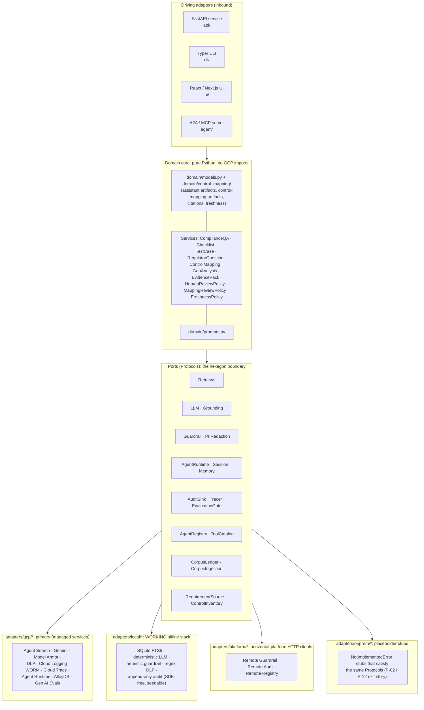
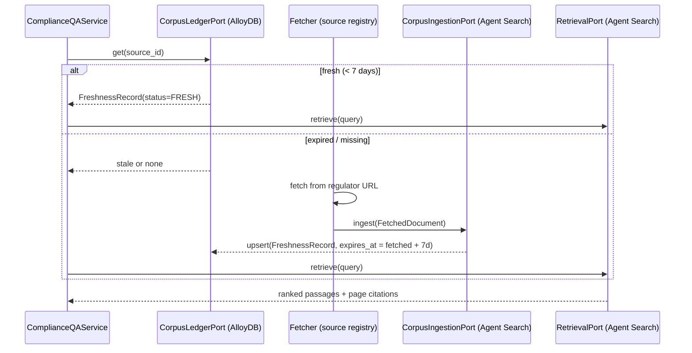
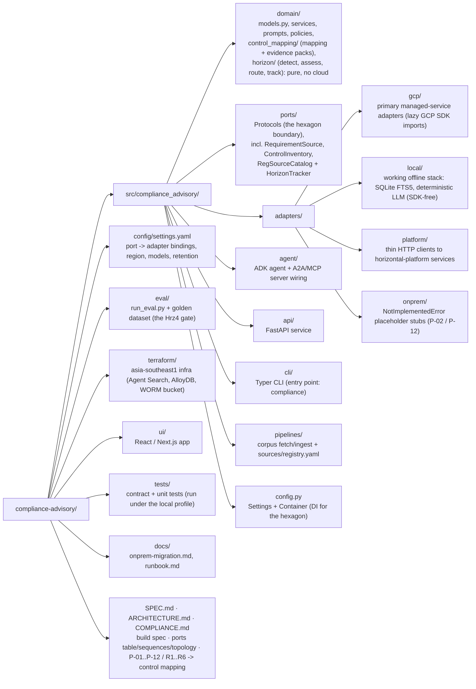

# Rsk1: Compliance Assistant & Control Mapper

> **Authority:** SPEC > ARCHITECTURE > COMPLIANCE > README > `docs/`. See
> [`docs/doc-authority.md`](docs/doc-authority.md).

**Industries:** Banking, Insurance, Capital markets; also Healthcare and Public sector (regulated cloud / AI)

> Grounded RAG + agentic assistant **and control mapper** for Compliance / Risk / CISO
> teams at APAC banks, over a knowledge base of **MAS / HKMA / APRA / FSA** regulations
> plus cross-jurisdiction cloud / AI guidance. One journey on **one shared regulatory
> knowledge base**: ask a question, get the control checklist, map each requirement to the
> GCP technical controls that satisfy it, assemble the regulator-grade evidence pack, and
> scan the regulatory horizon so a change to the corpus becomes an assessed, owned and
> tracked piece of work rather than a re-index.
> Built ports-and-adapters on the **Gemini Enterprise Agent Platform**, pinned to
> `asia-southeast1` (Singapore) for data residency.

> **Control mapping is a module of this service.** The Rsk2 Cloud Control-Mapping Toolkit
> sits in Rsk1 so the two capabilities share one regulatory knowledge base and one
> deployment. The mapping module reads the bank's live GCP control posture (Security
> Command Center + Cloud Asset Inventory + Assured Workloads) and evidences coverage
> against the same requirement text the assistant cites.

> **Horizon scanning is a module of this service too.** It reuses the SAME corpus and the
> SAME freshness ledger: the ledger carries the generation each ingest supersedes, so a
> republished, re-versioned, new or withdrawn instrument is detected by diffing what the
> repo already stores. Applicability and materiality are decided in pure code from
> bank-owned thresholds; the model only writes the rationale.

[](LICENSE)
[](pyproject.toml)

> **Reference build, not affiliated with, endorsed by, or sponsored by Google.**
> This is a public engineering portfolio piece. "Gemini Enterprise Agent Platform",
> "Agent Search", "Agent Runtime", "Model Armor", and other Google Cloud product names
> are trademarks of Google LLC and are used here only to describe the architecture. No
> warranty; see [`LICENSE`](LICENSE). Do not deploy against live regulated workloads
> without your own legal, security, and model-risk sign-off.

---

## 1. What Rsk1 produces

Rsk1 spans one journey over **one shared regulatory knowledge base**. The **answer /
checklist** family answers a Compliance/Risk analyst's question and returns cited
artifacts; the **control-mapping** family (the control-mapping module) turns the same cited
requirements into a coverage assessment and an audit-ready evidence pack. Every artifact
carries regulator-grade provenance (regulator + jurisdiction + document + version +
**page**):

**Answer / checklist family** (the assistant path):

| Artifact | Domain type | Service |
|----------|-------------|---------|
| **Answer**: grounded Q&A with full citations | `Answer` | `ComplianceQAService.answer()` |
| **ControlChecklist**: use-case-specific control checklist | `ControlChecklist` | `ChecklistService.build()` |
| **TestCase[]**: automated test cases verifying each control | `list[TestCase]` | `TestCaseService.generate()` |
| **RegulatorQuestion[]**: the exact questions a regulator/CRO will ask, with model answers | `list[RegulatorQuestion]` | `RegulatorQuestionService.generate()` |

**Control-mapping family** (the mapping module, `domain/control_mapping/`):

| Artifact | Domain type | Service |
|----------|-------------|---------|
| **ControlMapping[]**: each requirement mapped to the GCP control(s) that satisfy it, with a `Coverage` verdict (FULL / PARTIAL / NONE) computed from observed posture | `list[ControlMapping]` | `ControlMappingService.map()` |
| **ControlGap[]**: requirements whose controls are missing or misconfigured, each with severity + remediation | `list[ControlGap]` | `GapAnalysisService.analyze()` |
| **EvidencePack**: the auditor deliverable, mappings + observed posture + gaps + coverage summary, **always** human-reviewed | `EvidencePack` | `EvidencePackService.build()` |

**Horizon-scanning family** (the horizon module, `domain/horizon/`):

| Artifact | Domain type | Service |
|----------|-------------|---------|
| **HorizonScan**: every detected corpus movement, each with a deterministic applicability verdict, a materiality score and band with its named drivers, an accountable owner and its citation, **always** human-reviewed | `HorizonScan` | `HorizonScanService.scan()` |
| **ImplementationItem[]**: the tracked journey from a detected change to closure, linked to the GCP controls that evidence it | `list[ImplementationItem]` | `ImplementationTrackingService` |

> **The number is never the model's.** The materiality score is an additive 0..100 total of
> named drivers (change kind, document type, in-scope topic overlap, open control gaps for
> the same regulator), banded by thresholds that live in `config/settings.yaml` under
> `horizon:`. The score, the band, the applicability and the owner are computed and audited
> BEFORE the model is called; the model only writes the rationale, and it is handed the
> decisions as facts it must explain.

Catalog identity: **Rsk1**, group **`rsk`** (de-risking toolkits for CISO / CRO /
regulator), priority **P1**. Mandatory platform dependencies: **Hrz1** Guardrail Gateway,
**Hrz3** Registry, **Hrz5** Observability/Audit, with the **Hrz4** eval gate enforced at
promotion. Each dependency is a separate repo; see
[§9 Platform dependencies](#9-platform-dependencies). External consumer: **Rsk3**
(architecture validator) POSTs `/evidence-pack` to this service, shape unchanged.

Every artifact type, citation, and freshness record is a pure-stdlib dataclass in
[`src/compliance_advisory/domain/models.py`](src/compliance_advisory/domain/models.py),
the heart of the hexagon, with **zero** dependency on Google Cloud, ADK, or any framework.

---

## 2. Architecture: the hexagon

The domain core owns all orchestration and speaks only to **ports** (Python `Protocol`s).
Three interchangeable adapter families implement those ports. Switching the entire managed
stack to an on-prem one is a **one-line profile change** (`COMPLIANCE_PROFILE`) with no
domain edits, the proof of General Principle **P-02** (no vendor lock-in).



- **Driving (inbound) adapters**: the API, CLI, UI, and the A2A/MCP server, which translate
  external requests into domain calls.
- **Domain core**: services build the assistant and control-mapping artifacts by composing
  port calls. It never imports a cloud SDK. The control-mapping logic lives in its own
  `domain/control_mapping/` package (mapping, gap analysis, evidence-pack assembly, and the
  `MappingReviewPolicy`).
- **Ports**: `@runtime_checkable typing.Protocol`s under
  [`src/compliance_advisory/ports/`](src/compliance_advisory/ports/), so contract tests
  can assert any adapter satisfies each one. The merge added two: `RequirementSourcePort`
  (the requirement text for mapping) and `ControlInventoryPort` (the observed GCP posture).
- **Driven (outbound) adapters**: `gcp` (primary, real SDK calls), `local` (a working
  offline SDK-free stack: SQLite FTS5 + deterministic LLM), `platform` (thin HTTP clients to
  the horizontal-platform services), `onprem` (placeholder stubs).

See [`ARCHITECTURE.md`](ARCHITECTURE.md) for the full port to adapter table, the request-pipeline
sequence diagram, and the runtime topology.

---

## 3. Pinned GCP stack (current GA names, mid-2026)

> Platform note: the product is **Gemini Enterprise Agent Platform**; the API host is
> still `aiplatform.googleapis.com`. Rsk1 builds on the Agent
> Platform **API** layer, not the Gemini Enterprise *app*. Everything is pinned to
> `asia-southeast1`. The authoritative source for the stack is [`SPEC.md`](SPEC.md) §3.

| Concern | Service (current name) | Identifier |
|---------|------------------------|------------|
| Agent framework | ADK (Python) | `google-adk==2.7.1` |
| Reasoning model | Gemini 3.5 Flash | `gemini-3.5-flash` (thinking=high) |
| Triage model | Gemini 3.1 Flash-Lite | `gemini-3.1-flash-lite` |
| Unified SDK | Google GenAI SDK | `google-genai` |
| Retrieval | **Agent Search** (ex-Vertex AI Search) | `google-cloud-discoveryengine`; ADK `VertexAiSearchTool` |
| Web grounding | Gemini API `google_search` tool | `google-genai` (own sub-agent) |
| Runtime | **Agent Runtime** (ex-Agent Engine) | `google-cloud-aiplatform[agent_engines,adk]`; `reasoningEngine` |
| Sessions / Memory | Agent Platform Sessions / Memory Bank | ADK `VertexAiSessionService` / `VertexAiMemoryBankService` |
| Guardrail | Model Armor | `modelarmor.asia-southeast1.rep.googleapis.com` `:sanitizeUserPrompt` / `:sanitizeModelResponse` |
| PII redaction | Sensitive Data Protection / DLP | `google-cloud-dlp` `deidentifyContent` |
| Audit (WORM) | Cloud Logging locked bucket + Audit Logs | retention 2557 days (~7y); `DATA_READ` enabled |
| Tracing | Cloud Trace via OpenTelemetry | `opentelemetry-exporter-gcp-trace`; content capture **OFF** |
| Eval gate | Gen AI evaluation service | `vertexai.Client(...).evals` |
| Interop | A2A v1.0 + MCP 2026-07-28 | AgentCard `/.well-known/agent-card.json`; ADK `to_a2a`, `McpToolset` |
| Freshness ledger | AlloyDB | `google-cloud-alloydb-connector[pg8000]` + SQLAlchemy |
| Sovereignty | VPC-SC, regional CMEK, Org Policy, Assured Workloads | `asia-southeast1` |

**Gotchas honoured by the build** (SPEC §3): regional endpoints + per-service CMEK for
residency (the *global* endpoint gives none); message-content capture is **OFF** in spans
(PII); the locked log bucket is **irreversible** (retention is a Terraform var); the build
**never** uses the floating ADK default model or `gemini-2.0-flash` (discontinued); only
one built-in tool per agent → `google_search` lives in its own sub-agent.

---

## 4. Quickstart

### 4.1 `local` profile: a WORKING offline laptop stack (the dev / test default)

The `local` profile runs the whole pipeline end to end with **no Google Cloud, no API key,
and no running emulators**. Every port is bound to a real, deterministic, SDK-free local
adapter: SQLite FTS5 retrieval, a schema-driven deterministic LLM, a heuristic guardrail,
regex PII redaction, an append-only local audit store, and in-process stores. The core
dependencies are framework-light and the GCP SDKs live in the `[gcp]` extra.

```bash
git clone https://github.com/portable-genai/compliance-advisory.git
cd compliance-advisory

python3.12 -m venv .venv && source .venv/bin/activate
pip install -e ".[dev]"          # core + dev tooling, NO google-cloud-* packages

export COMPLIANCE_PROFILE=local
make lint test                   # ruff + mypy + pytest -m 'not integration'
```

**Run it offline.** The local retrieval index self-seeds a tiny synthetic regulatory
corpus on first use, so the primary CLI command returns a real, cited artifact with no
setup:

```bash
COMPLIANCE_PROFILE=local compliance ask \
  "What cloud outsourcing controls does MAS expect before onboarding a cloud provider?" --regulator MAS
```

It prints a grounded answer citing `mas-trm-guidelines p.42` (exit 0). To ground answers on
your own corpus, point `COMPLIANCE_LOCAL_DB` at a SQLite file and ingest documents through
`CorpusIngestionPort` (the `local` ingestion adapter indexes into the same FTS5 store).

Optional, higher-fidelity local development: set the standard Google emulator env vars and
install the `[gcp]` extra to route the registry / sessions / memory / ledger to the
**Firestore emulator** (`FIRESTORE_EMULATOR_HOST`); the google client is imported lazily,
only on that branch, so the default local path stays SDK-free. There is no emulator for
Agent Search, Gemini, Model Armor, DLP or Document AI, so those stay on the SDK-free
workaround.

### 4.2 `onprem` profile: fail-fast migration target

The `onprem` profile binds every port to a placeholder adapter that **constructs cleanly
but raises `NotImplementedError` from every method** (the Google Distributed Cloud
migration target). Contract tests confirm the placeholders satisfy the same Protocols as
the GCP adapters (interface parity), so a primary command fails fast with a clear migration
message and exit code 2:

```bash
COMPLIANCE_PROFILE=onprem compliance ask "What does APRA CPS 230 require?"   # exits 2
```

This is what makes the **exit / portability** story (P-12) real rather than aspirational;
see [`docs/onprem-migration.md`](docs/onprem-migration.md).

### 4.3 `gcp` profile: real managed stack in `asia-southeast1`

```bash
pip install -e ".[gcp,dev]"      # adds google-adk, google-genai, discoveryengine, dlp, ...

export GOOGLE_CLOUD_PROJECT=your-sg-project
export COMPLIANCE_PROFILE=gcp                 # set it explicitly; unset is a third state, not a chosen local
export COMPLIANCE_KMS_KEY="projects/.../locations/asia-southeast1/keyRings/.../cryptoKeys/..."
export COMPLIANCE_ALLOYDB_URI="projects/.../locations/asia-southeast1/clusters/.../instances/..."
gcloud auth application-default login

# Provision infra (fails fast if Agent Search is unavailable in the region):
make tf-plan                      # review, then `terraform apply` (see docs/runbook.md)
make run-api                      # FastAPI on :8080, profile=gcp
```

Everything is keyed off [`config/settings.yaml`](config/settings.yaml), which resolves
`${ENV_VAR}` tokens at load time. Switching profiles never touches code, only the
`COMPLIANCE_PROFILE` env var (or the `profile:` key).

---

## 5. Running the three surfaces

| Surface | Command | Notes |
|---------|---------|-------|
| **API** (FastAPI) | `make run-api` | REST + the A2A AgentCard at `/.well-known/agent-card.json`; OpenAPI at `/docs`. Three additive route families: the assistant path (`/ask`, `/checklist`, `/testcases`, `/regulator-questions`), the control-mapping path (`/map`, `/gaps`, `/evidence-pack`) and the horizon path (`/horizon/scan`, `/horizon/items`, `/horizon/items/{change_id}`, `/horizon/items/{change_id}/status`). |
| **CLI** (Typer) | `compliance ask "Does MAS TRM require multi-factor auth for privileged access?"` | Entry point `compliance = compliance_advisory.cli.main:app`. Sub-commands for `ask`, `checklist`, `testcases`, `regulator-questions`, `corpus` and `horizon` (`scan`, `track`, `set-status`). The control-mapping module is exposed over the API (`/map`, `/gaps`, `/evidence-pack`). |
| **UI** (React / Next.js) | `make run-ui` | Talks to the API; renders the assistant and control-mapping artifacts with inline citation chips. Embeddable into a host app (see [`docs/embedding-and-identity.md`](docs/embedding-and-identity.md)). |

API identity: request bodies carry **no `actor` field**. Every artifact route resolves a
verified `Principal` server-side (`IdentityPort`): seeded dev personas in the `local`
profile (pick one with the `X-Dev-Persona` header or the UI's Demo identity picker), a
verified Cloud IAP assertion in `gcp`/`platform`. Anything a client asserts about its own
identity is ignored.

The CLI runs end-to-end against the `local` profile with no cloud access, which makes it
the fastest way to see the pipeline and artifacts locally:

```bash
COMPLIANCE_PROFILE=local compliance ask "What does APRA CPS 230 require for critical operations?"
```

---

## 6. The 7-day fetch-at-runtime corpus

Rsk1 does **not** vendor a regulatory corpus into the repo. Regulations change; a stale copy
is a compliance risk. Instead the repo ships only a **source registry** plus a tiny
synthetic sample, and the corpus is materialised at runtime with a **7-day TTL**:



- **Where things live:** documents in **Agent Search**; the freshness ledger
  (`source_id`, `version`, `fetched_at`, `expires_at`, `checksum`, `status`) in **AlloyDB**.
- **On a read:** fresh sources (`< ttl_days`) are served from the store; expired or missing
  sources are re-fetched and re-ingested **before** the answer is generated.
- **Out of band:** a scheduled job (`make`-able locally; documented in
  [`.github/workflows/corpus-refresh.yaml`](.github/workflows/corpus-refresh.yaml) and
  [`docs/runbook.md`](docs/runbook.md)) refreshes sources whose TTL is about to expire.
- **Config:** `corpus.ttl_days` (default `7`) and `corpus.registry_path` in
  `config/settings.yaml`. The policy lives in `FreshnessPolicy(ttl_days)` in the domain.

The contract is `CorpusLedgerPort` + `CorpusIngestionPort`
([`ports/corpus.py`](src/compliance_advisory/ports/corpus.py)); the GCP adapters are
`AlloyDBLedgerAdapter` and `AgentSearchIngestionAdapter`.

**The ledger is also the horizon diff base.** Each record additionally carries the
generation it supersedes (`previous_version`, `previous_checksum`, `previous_fetched_at`,
`previous_status`), rolled forward by `domain/horizon/carry_forward` inside the same upsert
the ingest already performs. That single extension is what lets horizon scanning run on the
one ledger instead of a shadow copy, and a byte-identical re-fetch deliberately does not
advance the base, so an unscanned change stays visible:

```bash
COMPLIANCE_PROFILE=local compliance corpus refresh          # populate / refresh the ledger
COMPLIANCE_PROFILE=local compliance horizon scan "projects/acme-sg-prod"
COMPLIANCE_PROFILE=local compliance horizon track --open-only
```

---

## 6a. Regulatory horizon scanning

A corpus refresh that quietly re-indexes a republished instrument is not compliance work.
The horizon module turns each detected movement into an owned, tracked obligation:

| Step | What happens | Where |
|------|--------------|-------|
| **Detect** | Diff the freshness ledger: `NEW_SOURCE`, `CONTENT_REVISED`, `VERSION_BUMP`, `WITHDRAWN` | `domain/horizon/detection.py` (pure) |
| **Assess applicability** | Set membership against the bank's declared footprint (regulators, jurisdictions, in-scope topics), with the reasons recorded | `domain/horizon/policy.py` (pure) |
| **Score materiality** | Additive named drivers, capped and clamped to 0..100, banded by config thresholds | `domain/horizon/policy.py` (pure) |
| **Route ownership** | First matching topic rule, then a regulator rule, then the default owner, carrying the band's SLA | `domain/horizon/policy.py` (pure) |
| **Narrate** | The model explains the DECIDED verdicts. It cannot change them | `domain/horizon/prompts.py` |
| **Track** | One idempotent item per change; a human-set status survives a re-scan; closures link the GCP control ids that evidence them | `domain/horizon/tracking_service.py` |

Everything consequential is escalated: a routed change, a change at or above the configured
`review_band`, and any `implemented` / `accepted_risk` closure set `requires_human_review`
and are routed to the **Hrz7** maker-checker console (rule R8). The tracked journey is
tenant-partitioned and fail-closed: a cross-tenant read or write is refused with **403**,
never a 404 that would hide whether the change exists.

Tune the policy without touching code, in `config/settings.yaml`:

```yaml
horizon:
  in_scope_topics: [outsourcing, cloud, technology-risk, ...]
  change_kind_weights: {new_source: 40, content_revised: 32, ...}
  band_thresholds: {critical: 78, high: 58, medium: 34, low: 0}
  topic_owners: {outsourcing: third-party-risk-office, cloud: cloud-controls-office, ...}
  review_band: medium
```

---

## 7. The eval gate (Hrz4 / P-08)

No build is promoted without passing a quality gate. `EvaluationGatePort.evaluate()` runs a
golden dataset through the **Gen AI evaluation service** and returns an `EvalReport` scored
on **groundedness, citation accuracy, faithfulness, and safety**, alongside the
control-mapping metrics and the four horizon metrics (`horizon_applicability_accuracy`,
`horizon_materiality_accuracy`, `horizon_routing_accuracy`, `horizon_citation_accuracy`).
The report's `.passed` property is `True` only if *every* metric clears its threshold.

Each horizon metric is scored against the golden set's own `expected_outcome`, an oracle
independent of the product, and `tests/unit/test_horizon_eval_can_go_red.py` proves per
golden row that each metric can actually FAIL (via `agent_eval_kit.assert_each_can_go_red`).
A metric that re-reads the product's own verdict cannot go red and proves nothing.

```bash
make eval        # runs eval/run_eval.py; non-zero exit fails the gate
```

CI enforces it in [`.github/workflows/eval-gate.yaml`](.github/workflows/eval-gate.yaml):
the gate must pass before a release can be promoted to Agent Runtime. See
[`COMPLIANCE.md`](COMPLIANCE.md) for how this maps to the model-risk principle.

---

## 8. Security & residency posture

| Control | How it is enforced |
|---------|--------------------|
| **Server-verified identity** | The API never trusts a client-asserted `actor`: an `IdentityPort` adapter resolves a verified `Principal` per request (seeded personas in `local`, the Cloud IAP signed assertion in `gcp`/`platform`), which supplies the audit actor. Unresolvable identity is a 401. See [`docs/embedding-and-identity.md`](docs/embedding-and-identity.md). |
| **Embedding surface controls** | CSP `frame-ancestors` (env `COMPLIANCE_FRAME_ANCESTORS`, default `'self'`) limits which parents may iframe the UI; CORS is an explicit env allowlist (`COMPLIANCE_CORS_ORIGINS`, never `*`) with pinned methods/headers. |
| **Region pin** (`asia-southeast1`) | Every service and SDK call targets the Singapore region; Terraform **fails fast** if Agent Search is unavailable there. No global endpoints (they give no residency guarantee). |
| **VPC Service Controls** | All managed services sit inside a service perimeter so data cannot egress to other projects/regions. |
| **CMEK** (regional) | Customer-managed Cloud KMS keys (`COMPLIANCE_KMS_KEY`) encrypt Agent Search, AlloyDB, and the log bucket. |
| **PII redaction before model** (**P-04**) | `DlpRedactionAdapter` de-identifies inbound text *before* it reaches the model or any audit/trace sink. |
| **Guardrail screening** (Hrz1) | `ModelArmorGuardrailAdapter` screens INPUT and OUTPUT for prompt injection, jailbreak, sensitive data, and malicious URLs. |
| **WORM audit** (**P-07**) | `CloudLoggingAuditAdapter` writes already-redacted `AuditEvent`s to a **locked** Cloud Logging bucket (retention 2557 days, irreversible). |
| **Tracing without PII** | Cloud Trace via OpenTelemetry with message-content capture **OFF**: spans carry structure, never prompt/response text. |
| **Maker-checker** (**P-06**) | Every generated answer and consequential artifact requires review; bank-owned config controls escalation signals but cannot silently remove the checker. |
| **Citations** | Every claim carries a page-level `Citation` so a regulator/CRO can verify it. |
| **Exit / portability** (**P-12**) | `adapters/onprem/*` placeholders + [`docs/onprem-migration.md`](docs/onprem-migration.md) document the migration to Google Distributed Cloud with zero domain changes. |

The complete mapping of **every** General Principle (P-01..P-12) and dependency rule
(R1..R6) to a concrete file/resource in this repo is in [`COMPLIANCE.md`](COMPLIANCE.md).

---

## 9. Platform dependencies

Rsk1 depends on three sibling horizontal-platform services. When deployed standalone, the `gcp`
adapters call Model Armor / DLP / Cloud Logging directly; when deployed inside the full
platform, the `platform` adapters delegate to the services over HTTP (contracts in
[`SPEC.md`](SPEC.md) §6).

| Dep | Repo | Rsk1 ports it backs | `platform` adapter |
|-----|------|-------------------|--------------------|
| **Hrz1** Guardrail Gateway | `agent-guardrail-gateway` | `GuardrailPort`, `PIIRedactionPort` | `RemoteGuardrailAdapter` |
| **Hrz3** Registry | `agent-registry` | `AgentRegistryPort` | `RemoteRegistryAdapter` |
| **Hrz5** Observability/Audit | `agent-observability` | `AuditSinkPort` | `RemoteAuditAdapter` |

See [`ARCHITECTURE.md`](ARCHITECTURE.md) §6 for the dependency relationship in detail.

---

## 10. Repository layout



---

## 11. Documentation map

- [`SPEC.md`](SPEC.md): the authoritative build specification (locked decisions, pinned
  stack, adapter convention, pipeline, horizontal-platform HTTP contracts).
- [`ARCHITECTURE.md`](ARCHITECTURE.md): the port to adapter table (including the
  control-mapping and horizon ports), request pipeline sequence, the control-mapping
  pipeline, the horizon-scanning pipeline, Agent Runtime topology, freshness pipeline, and
  platform dependencies.
- [`COMPLIANCE.md`](COMPLIANCE.md): every General Principle and dependency rule mapped to
  a concrete control in this repo.
- [`docs/embedding-and-identity.md`](docs/embedding-and-identity.md): embed the UI into a
  client web app (same-origin reverse proxy), run standalone behind Cloud IAP, or run
  locally with seeded personas; the server-side identity contract and config knobs.
- [`docs/onprem-migration.md`](docs/onprem-migration.md): the exit/portability checklist
  (Google Distributed Cloud target).
- [`docs/runbook.md`](docs/runbook.md): deploy, region fail-fast, key rotation, retention,
  kill-switch.
- [`CONTRIBUTING.md`](CONTRIBUTING.md): how to set up, lint, test, and contribute.

---

## Cost and latency

Size this system's cost and latency with the shared interactive calculator: [**live**](https://portable-genai.github.io/cost-latency-calculator/calc/calculator.html?system=Rsk1) or the [in-repo page](cost-latency-calculator.html). The engine and the pricing book are maintained once in [cost-latency-calculator](https://github.com/portable-genai/cost-latency-calculator).

## License

Apache-2.0 © 2026 Ashish Awasthi. See [`LICENSE`](LICENSE).

> Again: this is an independent reference build and is **not affiliated with, endorsed by,
> or sponsored by Google LLC**. Google Cloud product names are used descriptively only.
