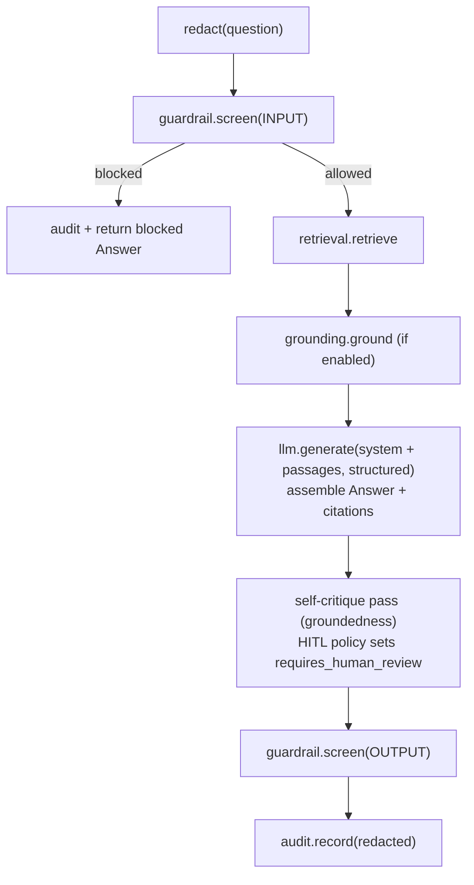

# Rsk1 Compliance Assistant: Build Specification

> **Authority:** SPEC > ARCHITECTURE > COMPLIANCE > README > `docs/`. See
> [`docs/doc-authority.md`](docs/doc-authority.md).

> Single source of truth for the implementation. The contract layer
> (`src/compliance_advisory/domain/models.py`, `src/compliance_advisory/ports/`,
> `config.py`, `config/settings.yaml`, `pyproject.toml`) is **authoritative**, read it
> before writing any adapter, service, test, or Terraform. Do not change the contract;
> implement against it.

## 1. What Rsk1 is

A grounded RAG + agentic assistant **and control mapper** for Compliance/Risk/CISO teams at
APAC banks, over a knowledge base of **MAS / HKMA / APRA / FSA** regulations plus
cross-jurisdiction **cloud / AI guidance**. One journey on **one shared regulatory knowledge
base**: ask, checklist, control mapping, evidence pack. It produces two families of cited
artifacts.

**Assistant / checklist family:**

1. **Answer**, grounded Q&A with regulator + jurisdiction + document + version + **page**
   citations.
2. **ControlChecklist**, use-case-specific control checklist.
3. **TestCase[]**, automated test cases that verify each control.
4. **RegulatorQuestion[]**, the exact questions a regulator/CRO will ask, with model answers.

**Control-mapping family** (the control-mapping module, `domain/control_mapping/`):

5. **ControlMapping[]**, each regulatory requirement mapped to the GCP control(s) that
   satisfy it, with a `Coverage` verdict (FULL / PARTIAL / NONE) computed server-side from
   the observed posture, a rationale, the regulator citation(s), and the supporting control
   observation(s).
6. **ControlGap[]**, requirements whose controls are missing or misconfigured, each with a
   severity, remediation guidance and citations.
7. **EvidencePack**, the auditor deliverable: mappings + observed posture + gaps + a
   coverage summary, always `requires_human_review=True`.

**Horizon-scanning family** (`domain/horizon/`, see §7):

8. **HorizonScan**, every detected movement in the regulatory corpus, each assessed for
   applicability and materiality in pure code, routed to an accountable owner, cited to the
   instrument that drove it and always human-reviewed.
9. **ImplementationItem[]**, the tracked journey from a detected change to its closure,
   linked to the GCP controls from the control-mapping family that evidence it.

The mapping requirement text is the **same** reg KB the assistant retrieves (bound
in-process, see §5.1); the observed posture comes from Security Command Center + Cloud Asset
Inventory + Assured Workloads (the `scc_inventory` adapter), with local/onprem parallels.
Horizon scanning reuses the **same** corpus and the **same** freshness ledger: the ledger
was extended with the generation it supersedes so it can be diffed, never shadowed by a
second store (§7.1).

Catalog identity: **Rsk1**, group **rsk** (De-risking toolkits / CISO·CRO·regulator), priority **P1**.
Mandatory platform dependencies: **Hrz1** Guardrail Gateway, **Hrz3** Registry, **Hrz5** Observability/Audit
(eval gate **Hrz4** at promotion). Each dependency is a separate repo: `agent-guardrail-gateway`,
`agent-registry`, `agent-observability`.

## 2. Locked decisions

| # | Decision |
|---|---|
| Repo | `compliance-advisory` (public, Apache-2.0), Python 3.12, ADK 2.3.0, React/Next.js UI |
| Retrieval | **Agent Search only** as the production backend. Terraform **fails fast** if Agent Search is unavailable in the selected region. No RAG-Engine / File-Search production fallback. |
| Web grounding | **Gemini API `google_search` tool**, assumed available in the Terraform-selected region; isolated in a grounding sub-agent. Toggle via `grounding_enabled`. |
| Reg KB data | **Fetch-at-runtime, 7-day TTL.** Docs stored in **Agent Search**; freshness ledger in **AlloyDB**. Fresh (<7d) → serve from store; expired → re-fetch + re-ingest before answering; scheduled job refreshes expiring sources. Repo ships only the source registry + a tiny synthetic sample. |
| Runtime | **Agent Runtime only** (managed, ex-Agent Engine) with GA Sessions + Memory Bank. |
| UI | **React / Next.js** app. |
| Region | `asia-southeast1` (Singapore) for every service. |
| Lock-in | Ports-and-adapters. GCP adapters are primary; **on-prem placeholder adapters** are `NotImplementedError` stubs satisfying the same Protocols (no open-source product named). Migration target is Google Distributed Cloud. |
| Control mapping | A **module of this service** (`domain/control_mapping/`), not a separate repo. Adds the `/map`, `/gaps`, `/evidence-pack` APIs and two ports (`RequirementSourcePort`, `ControlInventoryPort`). Coverage is computed **server-side** in `domain/control_mapping/_mapping.py` from which mapped controls are observed ENABLED (the model's coverage hint is only a fallback). |
| Reg-KB unification | **One** regulatory knowledge base. The mapping requirement source binds **in-process** to the assistant's existing retrieval (`RetrievalPort`, the `compliance-reg-kb` Agent Search store on `gcp`). Retired by the merge: the duplicate Gemini File Search store `control-mapping-reg-kb`, the old HTTP hop from the toolkit to the assistant's `/ask`, and the duplicate local reg seed. APRA CPS 234 (Information Security), the one reg instrument unique to the old toolkit seed, was carried into this repo's shared local corpus. |
| Horizon scanning | A **module of this service** (`domain/horizon/`). Change detection diffs the EXISTING AlloyDB/SQLite freshness ledger (extended with the superseded generation), applicability and materiality are pure code over config-owned thresholds (`horizon:` in `config/settings.yaml`), ownership routing is deterministic, and every consequential call routes to Hrz7. Adds `/horizon/*` and two ports (`RegSourceCatalogPort`, `HorizonTrackerPort`). |
| Posture sources | The mapping module reads the live GCP control posture from **Security Command Center + Cloud Asset Inventory + Assured Workloads** (`adapters/gcp/scc_inventory.py`), a canned deterministic posture on `local`, a fail-fast placeholder on `onprem`. No remote-platform variant: posture is read where the service runs. |

## 3. Pinned stack (current GA, mid-2026)

Platform note: the product is **Gemini Enterprise Agent Platform**; the API host is
still `aiplatform.googleapis.com`. Build on the Agent Platform **API** layer, not
the Gemini Enterprise *app*.

| Concern | Service (current name) | Identifier |
|---|---|---|
| Agent framework | ADK (Python) | `google-adk==2.3.0` |
| Reasoning model | Gemini 3.5 Flash | `gemini-3.5-flash` (thinking=high) |
| Triage model | Gemini 3.1 Flash-Lite | `gemini-3.1-flash-lite` |
| Unified SDK | Google GenAI SDK | `google-genai` |
| Retrieval | Agent Search (ex-Vertex AI Search) | `google-cloud-discoveryengine`; ADK `VertexAiSearchTool` |
| Web grounding | Gemini API `google_search` tool | `google-genai` |
| Runtime | Agent Runtime (ex-Agent Engine) | `google-cloud-aiplatform[agent_engines,adk]`; `reasoningEngine` |
| Sessions / Memory | Agent Platform Sessions / Memory Bank | ADK `VertexAiSessionService` / `VertexAiMemoryBankService` |
| Guardrail | Model Armor | `modelarmor.asia-southeast1.rep.googleapis.com` `:sanitizeUserPrompt`/`:sanitizeModelResponse` |
| PII redaction | Sensitive Data Protection / DLP | `google-cloud-dlp` `deidentifyContent` |
| Audit (WORM) | Cloud Logging locked bucket + Audit Logs | retention 2557 days; `DATA_READ` enabled |
| Tracing | Cloud Trace via OpenTelemetry | `opentelemetry-exporter-gcp-trace`; content capture OFF |
| Eval gate | Gen AI evaluation service | `vertexai.Client(...).evals` |
| Interop | A2A v1.0 + MCP 2025-11-25 | AgentCard `/.well-known/agent-card.json`; ADK `to_a2a`, `McpToolset` |
| Freshness ledger | AlloyDB | `google-cloud-alloydb-connector[pg8000]` + SQLAlchemy |
| Sovereignty | VPC-SC, regional CMEK, Org Policy, Assured Workloads | `asia-southeast1` |

⚠️ Gotchas to honour: regional endpoints + per-service CMEK for residency (global endpoint
gives none); message-content capture OFF in spans (PII); locked log bucket is irreversible
(retention is a Terraform var); never use the floating ADK default model or `gemini-2.0-flash`
(discontinued); one built-in tool per agent → `google_search` lives in its own sub-agent.

## 4. Adapter convention (the build contract)

* Every adapter constructor is `def __init__(self, settings: Settings) -> None`.
* Adapters are bound to ports by dotted path in `config/settings.yaml` under `adapters:`.
  **Module paths and class names there are fixed, match them exactly.**
* Four adapter families, selected by `COMPLIANCE_PROFILE` (`gcp | local | platform | onprem`):
  * `adapters/gcp/*`, primary managed-service adapters (real SDK calls). Production sets
    `COMPLIANCE_PROFILE=gcp` explicitly.
  * `adapters/local/*`, a **WORKING offline stack**, SDK-free, deterministic and seedable.
    Dev / test / CI set `COMPLIANCE_PROFILE=local` explicitly. Leaving the variable unset is a
    THIRD state, not a chosen `local`: the adapter family still falls back here, but no security
    decision reads the absence as consent, so the CORS dev-origin fallback is off and the no-auth
    seeded personas refuse to serve. An unknown or mis-capitalised value is refused outright.
    See the profile table below.
  * `adapters/platform/*`, thin HTTP clients to the horizontal-platform services (for
    `profile: platform`).
  * `adapters/onprem/*`, placeholder stubs that raise `NotImplementedError("...on-prem
    migration target...")` from every method but **construct cleanly** and **satisfy the
    Protocol** (so contract tests confirm interface parity). No third-party product named.
* GCP SDK imports must be **inside** methods/`__init__` (lazy), never at module top level,
  so the `local` and `onprem` profiles import without Google Cloud SDKs installed.

### 4.1 Profile backends

| Concern | `gcp` (managed) | `local` (SDK-free, offline) | `onprem` (fail-fast) |
|---------|-----------------|------------------------------|----------------------|
| Retrieval | Agent Search | SQLite **FTS5** (BM25), seedable | `NotImplementedError` |
| LLM | Gemini | deterministic schema-driven generator | `NotImplementedError` |
| Guardrail | Model Armor | heuristic injection / jailbreak blocker | `NotImplementedError` |
| PII redaction | DLP | regex (SG NRIC/FIN, email, phone) | `NotImplementedError` |
| Audit | Cloud Logging WORM | append-only SQLite / JSONL | `NotImplementedError` |
| Tracer | Cloud Trace | no-op spans | `NotImplementedError` |
| Registry / sessions / memory / ledger | AlloyDB / Firestore / Vertex | SQLite + in-process | `NotImplementedError` |
| Eval gate | Gen AI evaluation | the in-repo offline `eval/run_eval.py` | `NotImplementedError` |
| Grounding | `google_search` tool | disabled (no web egress) | benign defaults |
| Requirement source (mapping) | in-process bind to `RetrievalPort` (Agent Search) | in-process bind to `RetrievalPort` (SQLite FTS5) | in-process bind to the on-prem retrieval placeholder (fail-fast) |
| Control inventory (mapping) | SCC + Asset Inventory + Assured Workloads | canned deterministic posture | `NotImplementedError` |
| Source catalog (horizon) | in-repo source registry | in-repo source registry | in-repo source registry |
| Implementation tracker (horizon) | AlloyDB `horizon_tracking` | SQLite | `NotImplementedError` |

Default `local` is **SDK-free and emulator-free**. Optional higher-fidelity local runs route
the registry / sessions / memory / ledger to Google's official **Firestore emulator** when
`FIRESTORE_EMULATOR_HOST` is set AND the `[gcp]` extra is installed; the google client is
imported lazily, only on that branch, so the default local path imports no google-cloud
package. There is no emulator for Agent Search, Gemini, Model Armor, DLP or Document AI.

## 5. Orchestration pipeline (in `domain/`)

The domain services own orchestration and call only ports. Standard answer pipeline:



> All steps wrapped in `tracer.span`.

Services (constructors take explicit port instances; the API builds them from `Container`):

* `ComplianceQAService(retrieval, llm, guardrail, redaction, grounding, tracer, audit)` →
  `.answer(question, actor, filters=None) -> Answer`
* `ChecklistService(retrieval, llm, guardrail, redaction, tracer, audit)` →
  `.build(use_case, actor) -> ControlChecklist`
* `TestCaseService(retrieval, llm, guardrail, redaction, tracer, audit)` →
  `.generate(use_case, actor) -> list[TestCase]`
* `RegulatorQuestionService(retrieval, llm, guardrail, redaction, tracer, audit)` →
  `.generate(use_case, actor) -> list[RegulatorQuestion]`
* `HumanReviewPolicy.from_policy(...).requires_review(...) -> bool` (maker-checker, P-06):
  every generated answer and consequential artifact requires review. Confidence and severity
  can only raise the bar. Thresholds, review kinds and high-risk topics live in the bank-owned
  `policy:` configuration bundle.
* `FreshnessPolicy(ttl_days)` → `.expires_at(fetched_at)`, `.is_stale(record)`.
* Prompt templates live in `domain/prompts.py` (pure strings).
* `domain/serialization.py` → `to_jsonable(obj)` converts dataclasses/enums to JSON-safe
  dicts (used by remote clients and the API). Enums serialize to `.value`.

### 5.1 Control-mapping pipeline (`domain/control_mapping/`)

The mapping services own their own orchestration and call only ports. The requirement
source is bound **in-process** to the assistant's `RetrievalPort`: there is no second reg KB
and no HTTP hop. `ControlMappingService.map`:

```
requirement_source.fetch(scope, regulator)     [empty -> RequirementsEmptyError]
  -> control_inventory.observe(scope)          [unavailable -> PostureUnavailableError]
  +  control_inventory.list_controls()
  -> llm.generate(map requirements -> controls, structured JSON)
  -> assemble ControlMapping[]:
       resolve model control_ids back to real GcpControl objects (drop unknown ids)
       compute Coverage from which mapped controls are observed ENABLED (server-side)
       attach the requirement's Citation
       MappingReviewPolicy: PARTIAL/NONE or HIGH/CRITICAL gap -> requires_human_review
  -> audit.record
```

* `ControlMappingService(requirement_source, control_inventory, llm, tracer, audit)` →
  `.map(scope, actor, regulator=None) -> list[ControlMapping]`.
* `GapAnalysisService.analyze(scope, actor, regulator=None) -> list[ControlGap]` runs the
  mapping pipeline and returns only the gaps (PARTIAL/NONE mappings with severity +
  remediation).
* `EvidencePackService.build(scope, actor, regulator=None, tenant=None) -> EvidencePack`
  runs the mapping pipeline, derives gaps, computes the coverage summary, and stamps
  `requires_human_review=True` unconditionally.
* `MappingReviewPolicy` (maker-checker, P-06): a PARTIAL/NONE mapping or a HIGH/CRITICAL gap
  requires human review; an evidence pack always does. Escalations route to Hrz7 (rule R8).
* The shared machinery (LLM-request assembly, structured-output parsing, id→object
  resolution, coverage computation, severity coercion) lives in
  `domain/control_mapping/_mapping.py`.

The mapping module runs **without** the guardrail and PII-redaction steps of the assistant
path, by design: it reasons over the bank's own control posture and carries no customer PII.
See [`COMPLIANCE.md`](COMPLIANCE.md) for the per-module posture split.

## 6. HTTP contracts

### 6.0 Control-mapping APIs this service EXPOSES (additive)

Alongside the unchanged assistant routes (`POST /ask`, `/checklist`, `/testcases`,
`/regulator-questions`), the merge adds three additive routes. All JSON field names mirror
the domain dataclasses (enums as `.value` strings) via `domain/serialization.to_jsonable`.
The request body carries **no `actor`**: the audit actor is a server-verified `Principal`
resolved by the `IdentityPort`, never a client value. Empty requirements or an unobservable
posture map to **HTTP 422** with a clear detail (not a 500).

* `POST /map {scope, regulator?}` → `{scope, mappings: [ControlMapping]}`
* `POST /gaps {scope, regulator?}` → `{scope, gaps: [ControlGap]}`
* `POST /evidence-pack {scope, regulator?}` → `EvidencePack` (always
  `requires_human_review=true`)

**External consumer preserved:** Rsk3 (architecture validator) POSTs `/evidence-pack` to
this service, shape **unchanged** from the standalone toolkit; its client is being repointed
to this service's URL in the same workstream.

### 6.1 Horizontal-platform service HTTP contracts (so Rsk1 remote clients match the services)

All JSON field names mirror the domain dataclasses; enums are strings.

**Hrz1 `agent-guardrail-gateway`** (backed by Model Armor + DLP)
* `POST /v1/guardrail/screen` `{ "text": str, "direction": "input"|"output" }` →
  `{ "allowed": bool, "direction": str, "findings": [{"category":str,"confidence":str,"detail":str}], "sanitized_text": str|null, "reason": str }`
* `POST /v1/redact` `{ "text": str }` → `{ "text": str, "findings": [{"info_type":str,"count":int}] }`
* `GET /healthz` → `{ "status": "ok" }`

**Hrz3 `agent-registry`** (A2A + MCP catalog, AlloyDB-backed)
* `POST /v1/agents` `{AgentCard}` → 201
* `GET /v1/agents/{name}` → `{AgentCard}`
* `GET /v1/agents` → `[{AgentCard}]`
* `GET /.well-known/agent-card.json` → the registry's own card

**Hrz5 `agent-observability`** (WORM logging + Cloud Trace + FinOps)
* `POST /v1/audit` `{AuditEvent}` → 202
* `GET /v1/audit?actor=&action=&limit=` → recent redacted events (read-back for demos)
* OTLP trace ingest is infra (collector), not in this HTTP contract.

`AgentCard` JSON: `{ "name", "description", "url", "version", "provider",
"skills": [{"id","name","description"}] }`.
`AuditEvent` JSON: `{ "action","actor","decision","redacted_prompt","redacted_response",
"citations":[{...Citation}],"resource","trace_id","timestamp","metadata":{} }`.

## 7. Regulatory horizon scanning (`domain/horizon/`)

The fourth capability, built ON the corpus and freshness ledger this repo already
maintains rather than beside them. It answers a different question from "what does the
regulation say": **what just changed, does it apply to us, how much does it matter, who
owns it, and is it implemented yet.**

| Decision | Rationale |
|---|---|
| Change detection reuses the EXISTING freshness ledger | `FreshnessRecord` carries the superseded generation (`previous_version`, `previous_checksum`, `previous_fetched_at`, `previous_status`); the ingest pipeline rolls it forward on every upsert. There is no shadow store of corpus state. |
| Applicability + materiality are PURE CODE | `domain/horizon/policy.py` decides both from config-owned numbers. The LLM narrates the rationale and never produces the score. |
| Policy numbers live in config (B4) | `config/settings.yaml` under `horizon:`; the dataclass defaults in `policy.py` ARE the reference policy an adopter overrides. |
| Ownership routing is deterministic | First matching topic rule, then a regulator rule, then the configured default owner. |
| Every consequential call is human-reviewed | A routed change, a change at/above the configured review band, and a closure as `implemented` / `accepted_risk` all set `requires_human_review` and route to Hrz7 via `review-kit` (rule R8). |
| Materiality is linked to the control-mapping journey | Open control gaps for the same regulator are a materiality driver, so a change landing where the bank already fails scores higher. |

### 7.1 Change detection (`domain/horizon/detection.py`)

Two pure functions carry the mechanism:

* `carry_forward(previous, new) -> FreshnessRecord` attaches the superseded generation to
  the record the ingest pipeline is about to write. The diff base advances **only** when the
  content actually moved, so repeated no-op re-fetches inside the TTL cycle never erase an
  unscanned change.
* `detect_change(record, source) -> CorpusChange | None` classifies one ledger row against
  its registry entry (`RegSourceCatalogPort`).

`ChangeKind` (StrEnum, B5): `NEW_SOURCE`, `CONTENT_REVISED`, `VERSION_BUMP`, `WITHDRAWN`,
`UNCHANGED`. A `FAILED`/`MISSING` ledger status is a `WITHDRAWN` event even if the checksum
also moved, because the compliance action differs. A row with no registry entry carries no
provenance and is skipped rather than assessed on guessed metadata. A never-superseded
source keeps reporting as `NEW_SOURCE` until its content moves: nothing in the ledger records
that a human looked at it, and the stable, content-derived `change_id` keeps re-scans
idempotent rather than duplicative.

### 7.2 The deterministic policy (`domain/horizon/policy.py`)

**Applicability** is set membership against the declared footprint:

* in-scope regulator AND jurisdiction AND at least one in-scope topic -> `APPLICABLE`
* in-scope regulator AND jurisdiction, no in-scope topic -> `CONDITIONAL`
* otherwise -> `NOT_APPLICABLE` (scored zero, no owner, no review)

The matched and unmatched reasons are recorded on the assessment.

**Materiality** is an additive integer score on a 0..100 scale, assembled from named
`MaterialityDriver` contributions whose sum IS the score:

```
change_kind weight + doc_type weight
  + min(topic_points x in-scope topics, max_topic_points)
  + min(open_gap_points x open control gaps, max_open_gap_points)
  - conditional_penalty (only when applicability is CONDITIONAL)
```

banded by the config-owned `band_thresholds` (strongest floor first). Every number in that
formula is a `horizon:` key in `config/settings.yaml`.

**Ownership** is a first-match lookup (topic rules -> regulator rules -> `default_owner`),
carrying the band's `sla_days` as `due_within_days`.

### 7.3 Pipeline (`domain/horizon/scan_service.py`)

```
tracer.span("horizon.scan"):
  ledger.all()                        [empty -> CorpusLedgerEmptyError -> HTTP 422]
  + source_catalog.sources()
    -> detection.detect_changes       (pure diff)
    -> gap_service.analyze (optional) (open control gaps per regulator; best-effort)
    -> policy: applicability -> materiality -> owner -> review gate   [PURE]
    -> llm.generate(narrate, structured JSON)   [advisory prose ONLY]
    -> horizon_tracker.upsert         (idempotent; a human-set status is preserved)
    -> audit.record (ESCALATED)
    -> review_router.route(assessment) per escalation  (rule R8)
```

The ordering is the control: the assessment is complete before the model is called, and a
malformed or hostile model reply can only cost the scan its prose.

* `HorizonScanService(ledger, source_catalog, llm, tracer, audit, tracker=None,
  policy=None, gap_service=None, review_router=None)` -> `.scan(scope, actor,
  regulator=None, tenant="") -> HorizonScan` (always `requires_human_review=True`).
* `ImplementationTrackingService(tracker, tracer, audit, review_router=None)` ->
  `.list_items(tenant, open_only=False)`, `.get_item(change_id, tenant)`,
  `.update_status(change_id, status, actor, tenant, note="", control_ids=())`.

`ImplementationStatus` (StrEnum): `not_started`, `in_progress`, `implemented`,
`accepted_risk`, `not_applicable`. `control_ids` links a closure to the GCP controls the
control-mapping module already evidences, so an auditor walks from "the regulator changed
this" to "here is the control that answers it" without leaving the repo.

**Authorization is fail-closed and server-verified.** A tracked item is owned by exactly one
tenant. The port lookup is tenant-agnostic and the tenant check lives in the domain, so a
cross-tenant read or write returns **403** (never a 404 that hides existence) and a listing
is tenant-scoped in the adapter AND filtered again in the domain.

### 7.4 New ports and adapters

| Port | `gcp` | `local` | `onprem` |
|---|---|---|---|
| `RegSourceCatalogPort` | the in-repo source registry (`adapters/source_catalog.py`) | same class | same class |
| `HorizonTrackerPort` | AlloyDB `horizon_tracking` (`adapters/gcp/alloydb_horizon_tracker.py`) | SQLite (`adapters/local/horizon_tracker.py`) | `NotImplementedError` placeholder |

The source catalog is one class across every profile because the registry is a repo-local
file, not a managed service: that is what makes the horizon diff identical offline and in
production. The on-prem tracker raises rather than returning empty results, because
silently reporting "nothing to implement" would let an obligation disappear.

### 7.5 Horizon APIs this service EXPOSES (additive)

* `POST /horizon/scan {scope, regulator?}` -> `HorizonScan` (assessments with their
  materiality drivers and citations, plus a band summary; always
  `requires_human_review=true`)
* `GET /horizon/items?open_only=` -> the caller's tenant's tracked journey
* `GET /horizon/items/{change_id}` -> one tracked change (403 cross-tenant, 404 unknown)
* `POST /horizon/items/{change_id}/status {status, note?, control_ids?}` -> the updated item

No request body carries an `actor` or a `tenant`: both come from the verified `Principal`.

Like the control-mapping module, the horizon pipeline runs **without** the guardrail and
PII-redaction steps by design: it reasons over published regulatory instruments and the
bank's own implementation state, and carries no customer PII. See
[`COMPLIANCE.md`](COMPLIANCE.md) for the per-module posture split.

## 8. Coding standards

* Python 3.12, `from __future__ import annotations`, full type hints, ruff-clean.
* No secrets in code. Region pinned to `asia-southeast1`. Concrete Terraform values with
  `${var}` only for the project id and other genuinely per-tenant inputs.
* Tests must pass under the **local profile with no Google Cloud SDKs installed** (contract
  tests assert interface parity for both `local` and `onprem`; unit tests drive the domain
  services through the seeded `local` adapters).
* Each compliance control in `COMPLIANCE.md` maps to General Principles P-01..P-12 and
  dependency rules R1..R6 from the catalog.
