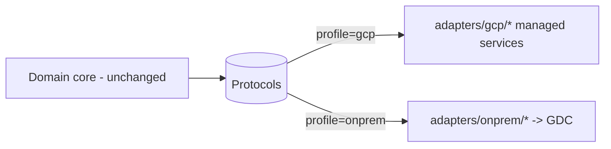

# On-prem migration: the exit / portability story (P-12)

This document is the concrete answer to a regulator's or CRO's "what is your exit plan?"
question. `compliance-advisory` is built ports-and-adapters precisely so the managed Google Cloud stack can be
swapped for an **on-premise / sovereign** deployment, the migration target is **Google
Distributed Cloud (GDC)**, with **zero changes to the domain core**.

Because the domain depends only on `typing.Protocol` ports (never on a cloud SDK), migration
is an *adapter* exercise, not a *rewrite*. The on-prem placeholder family already exists,
constructs cleanly, and satisfies every Protocol; migrating means filling in their method
bodies.

---

## 1. The one-line switch

The whole system selects its backend from a single setting:

```bash
export COMPLIANCE_PROFILE=onprem
```

or in [`config/settings.yaml`](../config/settings.yaml):

```yaml
profile: onprem
```

The `Container` in [`config.py`](../src/compliance_advisory/config.py) then binds every port
to its `adapters.onprem.*` entry instead of `adapters.gcp.*`. Nothing in
`src/compliance_advisory/domain/` is touched. The driving adapters (API, CLI, UI, A2A/MCP
server) are unchanged too, they call domain services, which call ports.



---

## 2. Why this is real, not aspirational

- **Interface parity is tested.** The on-prem placeholders are not loose stubs, each one
  satisfies the same `@runtime_checkable` Protocol as its GCP counterpart, and the contract
  tests assert it. If a port's signature drifts, the on-prem adapter fails the contract test,
  not production.
- **No GCP SDK required for the on-prem profile.** All Google Cloud SDK imports in the `gcp`
  adapters are **lazy** (inside `__init__` / methods). The on-prem profile imports and runs
  with **no** `google-cloud-*` package installed, proof the domain has no hidden cloud
  dependency. `pip install -e ".[dev]"` (without `[gcp]`) is enough.
- **One construction convention.** Every adapter is `def __init__(self, settings: Settings)`,
  so the GDC implementations slot into the existing `Container` wiring with no factory
  changes.

The placeholders today raise
`NotImplementedError("...on-prem migration target...")` from every method (no third-party
product is named). That is deliberate: the *interface* is committed and tested; the
*implementation* is the migration work, sized below.

---

## 3. Migration checklist: adapters to implement

Fill in each `adapters/onprem/*` class against its Protocol. Suggested GDC-class backing
technology is illustrative; choose your sovereign stack to taste, the domain does not care.

| # | Port | On-prem adapter to implement | What it must do on GDC |
|---|------|------------------------------|------------------------|
| 1 | `RetrievalPort` | `onprem.retrieval:OnPremRetrievalAdapter` | Vector/keyword retrieval over the in-cluster reg KB, returning `RetrievedPassage` with page-level `Citation` |
| 2 | `LLMPort` | `onprem.llm:OnPremLLMAdapter` | `generate()` + `classify()` against an on-prem / GDC-hosted Gemini or equivalent model endpoint |
| 3 | `GroundingPort` | `onprem.grounding:OnPremGroundingAdapter` | Public-web grounding via an approved egress proxy, or return empty + `enabled=False` if disallowed |
| 4 | `GuardrailPort` | `onprem.guardrail:OnPremGuardrailAdapter` | INPUT/OUTPUT screening; ideally delegate to a sovereign guardrail service |
| 5 | `PIIRedactionPort` | `onprem.redaction:OnPremRedactionAdapter` | In-cluster PII de-identification before model/audit (preserve P-04) |
| 6 | `AgentRuntimePort` | `onprem.runtime:OnPremAgentRuntimeAdapter` | Host the ADK agent on GDC compute; `query()` + `health()` |
| 7 | `SessionPort` | `onprem.session:OnPremSessionAdapter` | Per-case session store (e.g. in-cluster Postgres) |
| 8 | `MemoryPort` | `onprem.memory:OnPremMemoryAdapter` | Durable analyst memory store with semantic search |
| 9 | `AuditSinkPort` | `onprem.audit:OnPremAuditAdapter` | WORM-equivalent append-only audit sink with the same retention (preserve P-07) |
| 10 | `ObservabilityTracerPort` | `onprem.tracer:OnPremTracerAdapter` | OTel export to an in-cluster collector; content capture OFF (preserve the P-04 data-minimisation posture) |
| 11 | `EvaluationGatePort` | `onprem.evaluation:OnPremEvalAdapter` | Run the eval suite locally; return `EvalReport` (preserve P-08) |
| 12 | `AgentRegistryPort` | `onprem.registry:OnPremRegistryAdapter` | A2A AgentCard registry, in-cluster |
| 13 | `ToolCatalogPort` | `onprem.tool_catalog:OnPremToolCatalogAdapter` | Governed MCP tool catalog, in-cluster |
| 14 | `CorpusLedgerPort` | `onprem.ledger:OnPremLedgerAdapter` | Freshness ledger in an in-cluster Postgres (preserve the 7-day TTL semantics) |
| 15 | `CorpusIngestionPort` | `onprem.ingestion:OnPremIngestionAdapter` | Ingest fetched documents into the on-prem retrieval index |
| 16 | `ControlInventoryPort` | `onprem.inventory:OnPremControlInventoryAdapter` | Observe the sovereign control posture (the GDC/on-prem analogues of SCC + Asset Inventory + Assured Workloads) for the control-mapping module |

> The control-mapping module's `RequirementSourcePort` needs **no** separate on-prem
> adapter: it binds in-process to whichever `RetrievalPort` adapter the profile selects, so
> implementing `OnPremRetrievalAdapter` (row 1) also serves the mapping requirement source.

---

## 4. Step-by-step

1. **Stand up GDC** in your sovereign region; provision in-cluster equivalents (model
   endpoint, retrieval index, Postgres for sessions/memory/ledger, OTel collector,
   append-only audit store, CMEK-equivalent key management).
2. **Implement the adapters** in the table above. Keep the same construction convention
   (`__init__(self, settings: Settings)`) and keep any heavy imports lazy.
3. **Point bindings at them**, they are already wired in `config/settings.yaml` under each
   port's `onprem:` entry. No change needed unless you add new classes.
4. **Run the contract + unit suite** under `COMPLIANCE_PROFILE=onprem`: `make test`. Parity
   tests confirm the interfaces; unit tests confirm the pipeline behaviour.
5. **Re-run the eval gate** (`make eval`) against the on-prem stack to re-establish the `model-quality-gate`
   quality bar before promotion (P-08).
6. **Re-validate the compliance controls** that have on-prem analogues, residency (P-01),
   CMEK-equivalent encryption (P-10), WORM-equivalent audit (P-07), content-free tracing
   (part of the P-04 posture), and the defense-in-depth layers the control-mapping module
   evidences (P-09: CMEK, Assured Workloads, least-privilege IAM, private endpoints). The
   control intent does not change; only the backing technology does.
7. **Cut over** by flipping `COMPLIANCE_PROFILE` to `onprem` in the deployment environment.

---

## 5. What does *not* change

- `src/compliance_advisory/domain/`, models, services, prompts, policies, serialization,
  including the `domain/control_mapping/` module.
- The artifacts and their citation/freshness semantics: the assistant's answer / checklist /
  test cases / regulator questions, and the mapping module's control mappings / gaps /
  evidence packs.
- The API / CLI / UI / A2A surfaces.
- The pipeline order (redact → screen → retrieve → generate → critique → review → screen →
  audit) and every invariant it enforces.

That is the portability guarantee: the *behaviour and the controls* are domain-resident; the
*infrastructure* is adapter-resident and swappable.
