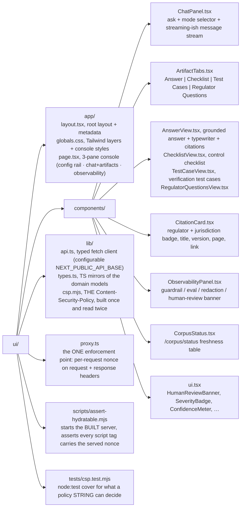

# `compliance-advisory`: Demo UI

A polished, banking-grade demo console for `compliance-advisory`, the grounded RAG + agentic
assistant for Compliance / Risk teams at APAC banks (MAS / HKMA / APRA / FSA plus
cross-jurisdiction cloud & AI guidance). It is a thin presentation layer over the
`compliance-advisory` FastAPI backend, it renders the four cited artifacts and the governance
signals, and never bypasses the guardrail or maker–checker gates.

Built with **Next.js (App Router) + TypeScript + Tailwind**. Dependencies are kept
minimal: `next`, `react`, `react-dom`, `tailwindcss`, `postcss`, `autoprefixer`,
`typescript`, and the `@types` packages, nothing else.

## What it shows

- **Left config rail**, regulator filter (MAS / HKMA / APRA / FSA / CROSS), web
  grounding toggle (the `grounding_enabled` request flag), and the grounding
  posture (page-level citations, guardrail on I/O, PII redaction, maker–checker).
- **Chat console**, ask grounded questions or generate any of the four artifacts.
  The answer body reveals with a lightweight streaming-style typewriter.
- **Artifact tabs**, **Answer | Checklist | Test Cases | Regulator Questions**,
  each with regulator + jurisdiction badges, document title, version, page, and a
  link on every citation.
- **Right observability panel**, `agent-guardrail-gateway` verdict (input/output), `model-quality-gate`
  eval/confidence, PII redaction tallies, trace id, decision pill, and a prominent
  **"Human review required"** banner for the maker–checker gate.
- **Corpus freshness**, a live table from `/corpus/status` showing the 7-day
  fetch-at-runtime ledger.

## The four artifacts (and the maker–checker gate)

| Tab | Endpoint | Domain type | Human review |
|-----|----------|-------------|--------------|
| Answer | `POST /ask` | `Answer` | when `requires_human_review` (low-confidence / high-severity) |
| Checklist | `POST /checklist` | `ControlChecklist` | always (consequential output) |
| Test Cases | `POST /testcases` | `TestCase[]` | always (consequential output) |
| Regulator Questions | `POST /regulator-questions` | `RegulatorQuestion[]` |, |

The **Human review required** banner is rendered prominently both above the
artifact and in the observability rail whenever the active artifact is gated for a
second reviewer (checker) per General Principle **P-06**.

## Prerequisites

- Node.js 18.18+ (tested on Node 20/22)
- The `compliance-advisory` FastAPI backend running and reachable (default `http://localhost:8000`)

## Configure

The backend base URL is configurable via `NEXT_PUBLIC_API_BASE`:

```bash
cp .env.local.example .env.local
# edit .env.local if your backend is not on http://localhost:8000
```

If unset, the UI falls back to `http://localhost:8000`. The current value is shown
in the top bar, with a live `up / down` health indicator polling `/healthz`.

Embedding into a host application (build-time, see
[`docs/embedding-and-identity.md`](../docs/embedding-and-identity.md)):

- `NEXT_PUBLIC_EMBED=1` renders the console without its own top bar (the host owns
  the chrome).
- `NEXT_PUBLIC_BASE_PATH=/assistant` mounts the app and its assets under a
  reverse-proxy sub-path; blank keeps the standalone behavior.
- `NEXT_PUBLIC_FRAME_ANCESTORS` names the parent origins allowed to iframe the
  console. It is read per request in `proxy.ts`, so it is a deploy-time value, not a
  build-time one. Three states, mirroring the backend's `COMPLIANCE_FRAME_ANCESTORS`:
  unset keeps `'self'`, set-but-naming-nothing resolves to `'none'` (nobody may frame
  this), a set value names exactly those origins.

## Security headers and hydration

The console's Content-Security-Policy is built in exactly one module, `lib/csp.mjs`, and
emitted from exactly one place, `proxy.ts`. `next.config.mjs` deliberately does NOT emit a
CSP: two layers both setting one gives the browser two policies to intersect, and the
stricter wins per directive.

`script-src` carries a PER-REQUEST nonce plus `'strict-dynamic'`. This is load-bearing, not
cosmetic. Next serves its hydration bootstrap as an INLINE script, so a bare
`script-src 'self'` blocks it, `__next_f` never fills, React never attaches, and the console
renders every control as dead markup that looks correct in a screenshot.

A nonce only works on a DYNAMICALLY rendered route, which is why `app/layout.tsx` sets
`export const dynamic = "force-dynamic"` and `next.config.mjs` refuses to build without it.
A nonce on a statically prerendered page blocks strictly MORE than the unfixed policy did,
because `'strict-dynamic'` turns off the `'self'` fallback.

## Gate

```bash
npm run lint              # tsc --noEmit
npm test                  # node:test cover for lib/csp.mjs
NEXT_TELEMETRY_DISABLED=1 npm run build
npm run assert-hydratable # starts the BUILT server; asserts the served nonce is on every script
```

Or `make ui-check` from the repo root, which runs exactly those four in order.
`assert-hydratable` must run LAST, against the artefact the build just produced. The unit
tests are NOT sufficient on their own and say so in their header: the CSP header string is
byte-identical in the working and the broken case, so only a check that executes the served
document can tell them apart.

## Run

```bash
npm install
npm run dev      # http://localhost:3000
```

Production build:

```bash
npm install
npm run build
npm run start
```

## Backend contract

The typed client (`lib/api.ts`) and TS mirrors (`lib/types.ts`) follow the domain
dataclasses in `src/compliance_advisory/domain/models.py`, serialised per the
`domain/serialization.to_jsonable` convention (SPEC §5): dataclass field names are
preserved (snake_case) and every enum is rendered as its `.value` string.

Endpoints consumed:

- `POST /ask` `{ question, grounding_enabled?, filters? }` → `Answer`
- `POST /checklist` `{ use_case, filters? }` → `ControlChecklist`
- `POST /testcases` `{ use_case, filters? }` → `TestCase[]`
- `POST /regulator-questions` `{ use_case, filters? }` → `RegulatorQuestion[]`
- `GET /corpus/status` → `FreshnessRecord[]`
- `GET /healthz` → `{ status: "ok", profile, region }`
- `GET /personas` → seeded dev personas (local profile only; `[]` otherwise)

There is deliberately **no `actor` field** in any request body: the backend resolves
the audit actor server-side from the verified `Principal` (see
[`docs/embedding-and-identity.md`](../docs/embedding-and-identity.md)). In the local
profile the client selects a seeded persona via the `X-Dev-Persona` header, which the
**Demo identity** picker in the left rail manages for you (it renders only when
`/healthz` reports `profile: "local"`).

The client is tolerant of two response framings for the four POST artifacts: a
**bare** domain object/array, or an **enveloped** form such as
`{ "answer": Answer, "observability": { … } }`. When an observability envelope is
present (guardrail verdict, eval report, redaction findings, trace id, decision),
the right rail renders it; otherwise the panel derives what it can from the
artifact itself (e.g. answer confidence) and stays minimal.

> Note: at the time this UI was written the backend exposed the contract layer
> (`domain/models.py`, `ports/`) but not yet the FastAPI routes. The response
> shapes above are inferred directly from the authoritative dataclasses, so the UI
> is ready to light up as soon as the routes land. If a field name differs, adjust
> the matching interface in `lib/types.ts` and the unwrap keys in `lib/api.ts`.

## Project layout



## Notes

- Pure presentation: no secrets, no direct cloud calls. All data comes from the
  `compliance-advisory` backend over the documented routes.
- Region/branding reflects the locked decisions (Singapore `asia-southeast1`).
- Graceful degradation: every endpoint surfaces clear errors in-line; the corpus
  table and health pill show backend reachability without crashing the console.
```
